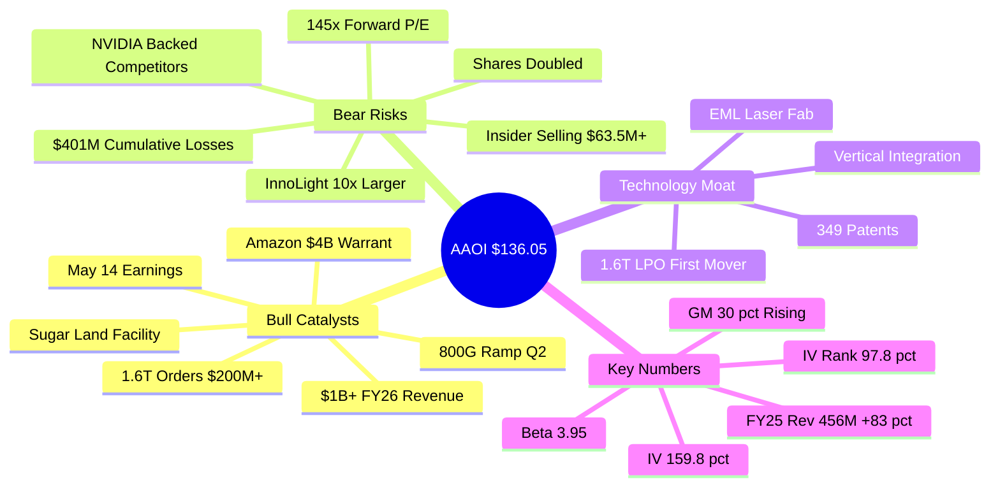
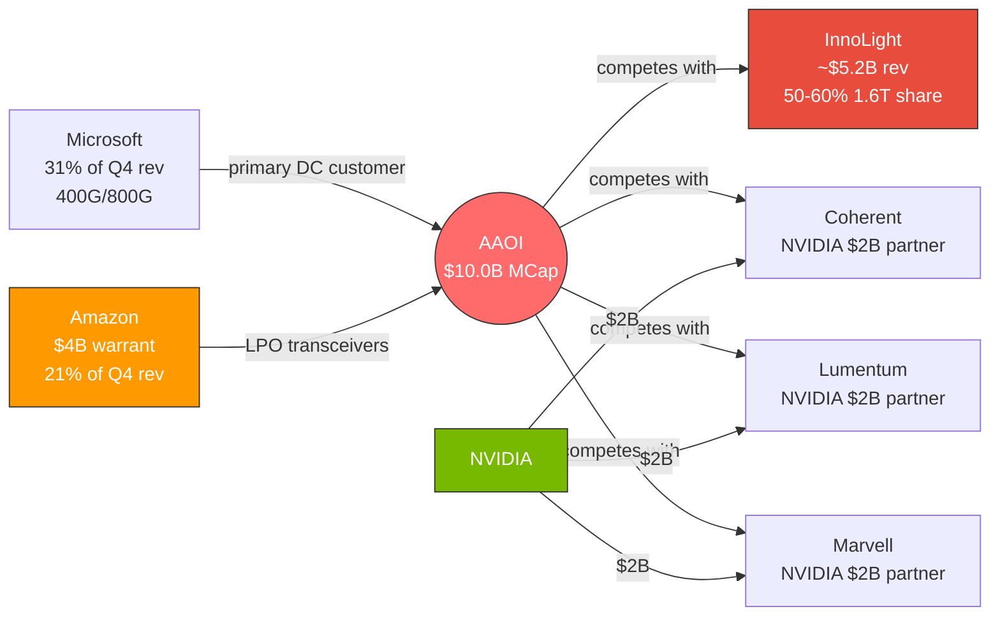
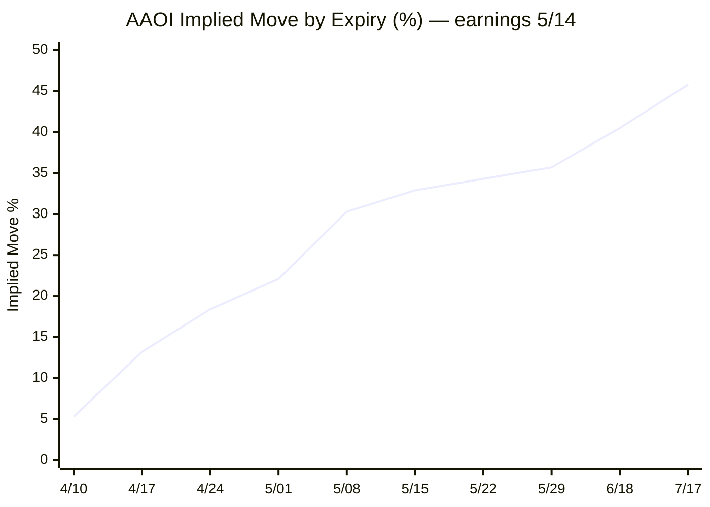

# AAOI (Applied Optoelectronics) — Research Vault

> **Last Updated**: April 9, 2026 (post-market) — refreshed via Unusual Whales API
> **Price**: $136.05 (close) / prev close $133.30 | **MCap**: $10.02B
> **Sector**: Technology — Fiber Optic Transceivers | **HQ**: Sugar Land, TX

> [!important] Bottom Line (2026-04-09)
> Stock ripped **+30.9% in 3 sessions** ($103.91 → $136.05), breaking the prior ATH of $128.96 (intraday high $136.99 today). IV rank is now **97.8% of its 1-year range**, meaning options are near their most expensive in 12 months. Max pain across ALL near-term expiries is **below spot** ($90–$115 vs $133), signaling structurally short-call dealer positioning with pinning pressure downward. **May 14 earnings** is the single catalyst, and the post-earnings 5/15 expiry implies a **±33% move**. Insider selling totals **$63.5M+ across 2025–2026** (not $27M as previously logged)—far more extensive than the prior snapshot suggested. CEO Thompson Lin remains the only insider who has not sold.

---

## Research Files

| # | File | Contents |
|---|------|----------|
| 1 | [[01-Company-Overview]] | Snapshot, vertical integration, Amazon warrant, price arc |
| 2 | [[02-Technology-Edge]] | EML moat, 1.6T LPO specs, patents, R&D, SiPh/CPO risk |
| 3 | [[03-Competitor-Analysis]] | COHR, LITE, FN, InnoLight — financials, tech, insiders |
| 4 | [[04-Financials-CapEx]] | Revenue hockey stick, CapEx, RORE, dilution, analysts |
| 5 | [[05-Insiders-Board]] | Board bios, Thompson Lin story, transaction timeline |
| 6 | [[06-Supply-Chain-Geopolitics]] | Supply chain map, tariffs, gallium crisis, war scenarios |
| 7 | [[07-Options-Flow-Intelligence]] | IV term structure, earnings reactions, OI, darkpool |
| 8 | [[08-Bull-Bear-Outlook]] | 3mo/3yr scenarios, AI CapEx cycle, M&A comps |

---

## Dashboard

---

## Quick Stats

| Metric | Value | | Metric | Value |
|--------|-------|-|--------|-------|
| Price (close) | **$136.05** | | Beta | **3.9456** |
| Market Cap | **$10.02B** | | Shares Out | 75.2M |
| IV | **159.8%** | | IV Rank (1Y) | **97.8%** |
| Avg 30d Vol | 13.5M | | Next Earnings | **May 14, 2026** |
| 52W Low | $9.71 <!-- needs verification --> | | 52W High | **$136.99** (new ATH 4/9/26) |
| FY2025 Rev | $455.7M (+83%) | | FY2026 Guide | >$1B (+120%) |
| Gross Margin | 30.0% | | FY2025 EPS (GAAP diluted) | -$0.64 |
| Q4 '25 EPS | -$0.01 (beat -$0.11 est, +91%) | | Q1 '26 EPS est | -$0.10 |
| Call OI | 119,185 | | Put OI | 103,810 |
| Net insider selling (2025–26) | **-$63.5M** | | Insider buys (2025–26) | +$1.66M |
| ATL | $1.48 (Jul '22) <!-- needs verification --> | | Prior ATH | $128.96 (now exceeded) |

---

## Key Relationships

> [!note] NVIDIA partnership gap
> NVIDIA routed **~$6B** to three AAOI competitors (Coherent, Lumentum, Marvell) in March–April 2026. AAOI's offset is the Amazon $4B warrant — different hyperscaler, same strategic alignment lens.

---

## Options Earnings-Cycle Map (IV Term Structure)

> [!tip] Earnings vol snapshot
> First post-earnings expiry (5/15) prices a **±33% move** — the steepest kink on the IV term structure. The 5/8 contract (pre-earnings) already carries **159.8% IV** — earnings crush risk on long straddles is severe.

---

#trading #AAOI #optics #AI #datacenter #semiconductor #research
