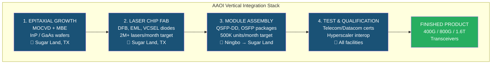
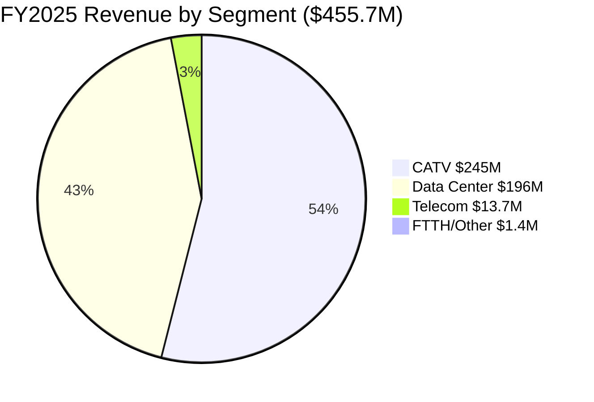
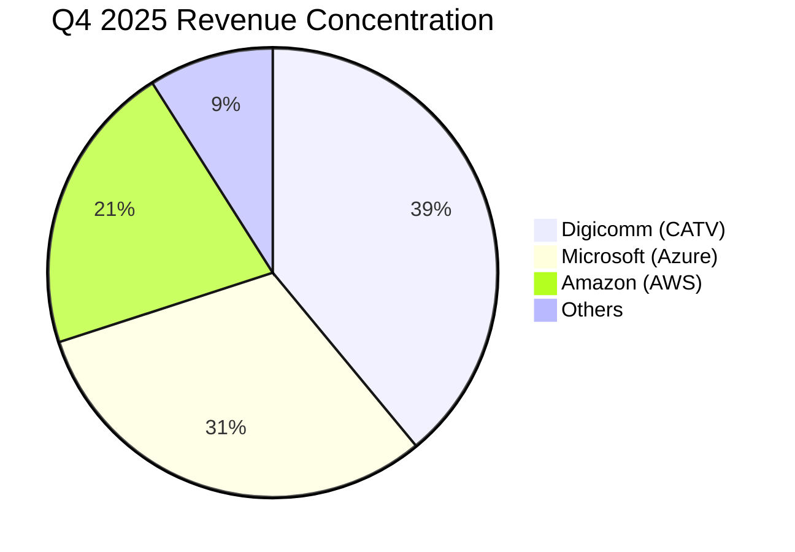
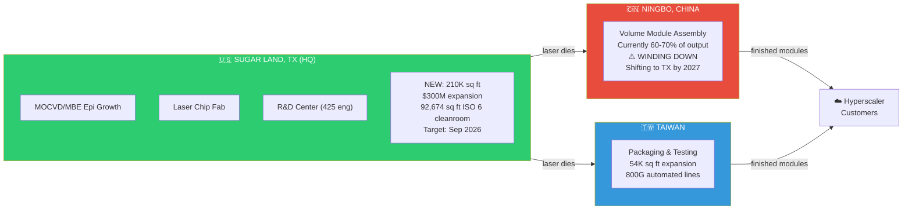

# AAOI — Company Overview

> [!info] Quick Facts
> Applied Optoelectronics, Inc. (NASDAQ: `AAOI`)
> Founded: 1997 | IPO: 2013 | HQ: Sugar Land, TX

> [!abstract] Bottom Line (updated 2026-04-09)
> AAOI is a **$10.0B mid-cap AI-optics play** that ran from $103 to a fresh ATH above **$136** in 3 trading days, putting IV rank at the 1-year max (97.8%) ahead of **May 14 earnings**. The bull case is a $4B Amazon warrant deal, 1.6T LPO first-mover status, and 83% FY2025 revenue growth; the bear case is $63.5M+ of insider selling into the rally, -$0.64 FY25 diluted EPS, and a ~22x P/S multiple that bakes in flawless execution.

---

## What AAOI Does

AAOI designs, manufactures, and sells **fiber optic transceivers** — the devices that convert electrical signals to light and back, enabling high-speed data transmission over optical fiber. They are **vertically integrated**, meaning they make their own laser chips from raw semiconductor wafers all the way through to finished transceiver modules.



> [!info] Why this matters
> Most competitors buy lasers from third parties. AAOI makes them in-house — controlling 30–50% of the BOM cost and ensuring supply security.

---

## Revenue Segments (FY2025)



> [!important] Key Shift
> Data Center is rapidly overtaking CATV. In Q4 2025, DC revenue hit $74.9M (+69% YoY, +70% QoQ). By FY2026, DC will be the **majority segment** (~$700M of $1B+ guided).

---

## Key Customers (Q4 2025 Exact Breakdown)

Q4 2025 had **three >10% customers** (per management on the 2/26/26 call): one CATV customer at 39% and two data center customers at 31% and 21%. Management specifically flagged that one of the DC customers "became a 10% customer for the first time in a long time" — per FY2025 10-K data (Microsoft = 28.8%, Digicomm = 53.1%), that new entrant is Amazon.

| Customer | Segment | % of Q4 Revenue | Products |
|----------|---------|-----------------|----------|
| **Digicomm** (CATV #1) | CATV | **39%** | Laser transmitters (DOCSIS 4.0) |
| **Microsoft (Azure)** | Data Center | **31%** | 400G/800G transceivers |
| **Amazon (AWS)** | Data Center | **21%** | 400G/800G LPO transceivers (new >10% per Q4 call) |
| Others | Mixed | ~9% | — |



> [!note]
> Top 10 customers = **96% of Q4 revenue** (vs 97% in Q4 2024). FY2025 concentration: Digicomm 53.1%, Microsoft 28.8% (per 10-K). Three >10% customers in Q4 = 91% of the quarter.

### Amazon Warrant Deal (March 13, 2025)

> [!tip] GAME-CHANGING DEAL
> **Amazon received warrants for up to 7.945M AAOI shares** at **$23.70/share exercise price**, vesting against up to **$4 billion in Amazon product purchases through March 13, 2035**. Stock rallied ~55% intraday / +82% after-hours on announcement.
>
> **Why this transforms AAOI:**
> - Amazon is now a **strategic partner**, not just a customer
> - $4B purchase commitment = **multi-year revenue floor** (decade-long vesting window)
> - Warrants align Amazon's financial incentives with AAOI stock price
> - **At $136.05/share (4/9/26 close)**, Amazon's 7.945M warrants have an **intrinsic value of ~$893M** (7.945M × ($136.05 − $23.70))
> - 1,324,233 shares vested immediately on issuance
> - Amazon became a >10% Q4 2025 customer "for the first time in a long time"
> - Similar structure to Amazon's Rivian partnership — long-term supply commitment

---

## Manufacturing Footprint



| Facility | Sq Ft | Employees | Function | Status |
|----------|-------|-----------|----------|--------|
| Sugar Land HQ | ~290K existing | ~450 (+500 planned) | Epi, laser fab, R&D | **Expanding** |
| Sugar Land NEW | 210K (FAB2) | TBD | 800G/1.6T assembly | **Under construction** (Sep '26) |
| Ningbo | Large | ~3,000+ est | Module assembly | **Winding down** |
| Taiwan | 54K+ | TBD | Packaging, testing | **Expanding** |

---

## Key Metrics Snapshot

*As of 2026-04-09 close (source: Unusual Whales API)*

| Metric | Value | Context |
|--------|-------|---------|
| Price | **$136.05** | Close 4/9/26; prev close $133.30 |
| Day Range (4/9) | $133.29–**$136.99** | New intraday ATH |
| Market Cap | **$10.0B** | Mid-cap, up from $7.8B on 4/6 |
| Shares Outstanding | 75.2M | Doubled in 2 years (dilution) |
| Beta | **3.95** | Extremely volatile — ~4x market moves |
| Avg 30d Volume | 13.5M shares | Very liquid |
| IV (Implied Volatility) | **159.8%** | Near 1Y high (RV running 170.7%) |
| IV Rank (1Y) | **97.8%** | Near MAX — options at peak richness |
| 52W Range (vault prior) | $9.71–$128.96 | High has been exceeded; fresh ATH >$136.99 |
| Next Earnings | **May 14, 2026** (confirmed) | Est EPS -$0.10; major catalyst |
| Dividend | None | Growth stage |

---

## The Full Arc: $1.48 → $136.99

```text
    AAOI STOCK PRICE HISTORY
    ══════════════════════════════════════════════════

    $136.99 ───────────────────────────────────  ← NEW ATH (Apr 9 '26 intraday)
    $128.96 ── Prior high (Mar 11 '26) ────────
    $103.41 ── Original ATH (Jul 27 '17) ───
                │
    $90+ ──── 2017 peak (Amazon/MSFT 100G) ──
                │
                ▼ Amazon shifted suppliers
    $8.50 ─── Aug 2019 trough (-91%) ────────
                │
                ▼ COVID + continued losses
    $1.48 ─── Jul 13, 2022 ALL-TIME LOW ─────  ← -98.6% from peak
                │
                ▼ 800G pivot begins
    $10 ───── Early 2024 ────────────────────
                │
    $15 ───── Mar 13, 2025: AMAZON WARRANT ──  ← +82% after hours
                │
    $50 ───── Feb 26, 2026: Q4 EARNINGS BEAT   ← +57% in 1 day
                │
    $100 ──── Early Mar 2026: Insider unload ─  ← $53.9M sold
                │
    $136.99 ── Apr 9, 2026 intraday ATH ─────  ← +9,150% from low
    $136.05 ── Apr 9, 2026 close ─────────────

    FROM NEAR-DEATH TO ~92x IN 4 YEARS
```

---

## Investment Thesis in One Paragraph

At **$136.05 / $10.0B market cap (4/9/26)**, AAOI is a **high-risk, high-reward AI-infrastructure play** anchored by a **$4B Amazon purchase commitment** (March 2025 warrant deal, now ~$893M intrinsic to Amazon at current price) and positioned at the center of the 400G → 800G → 1.6T transceiver upgrade cycle. Vertical integration (in-house InP laser fab, 349 issued patents) and first-mover 1.6T LPO shipments (>$200M initial order, March 2026) form a real technology moat. But the company has **never been consistently profitable** ($401M+ cumulative losses, FY25 GAAP diluted EPS of **-$0.64**), has doubled its share count via equity raises, and now trades at **~22x trailing P/S** ($10.0B / $455.7M) — leaving zero margin for execution error. NVIDIA has committed ~**$6B to AAOI peers** (Coherent $2B, Lumentum $2B, Marvell $2B) — not AAOI. InnoLight at >$5B revenue still dominates 800G volume. Insiders have **sold $63.5M+ net in 2025–2026** (31 sells vs 4 buys, $53.9M in March 2026 alone at $95–$113); CEO Thompson Lin remains the notable non-seller. With IV rank at 97.8% and earnings on **May 14**, options price a ~±30% move off the May 8 expiry. If $1B+ FY2026 revenue lands, this is still a $150–200 stock on a normalizing multiple. If they stumble, a name that went from $100+ to $1.48 before could do so again.

#AAOI #overview #research
