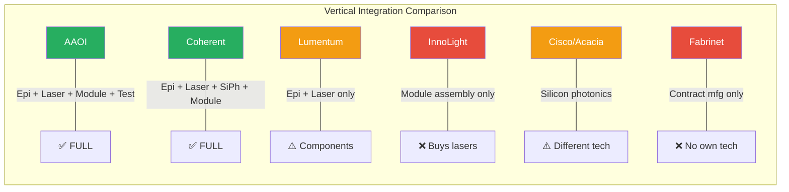
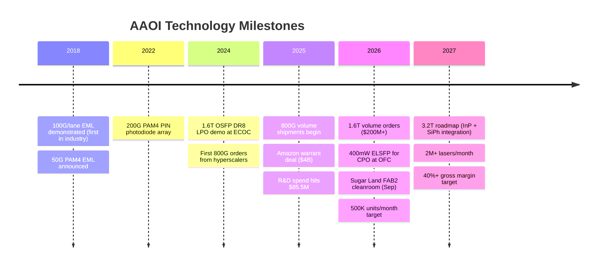
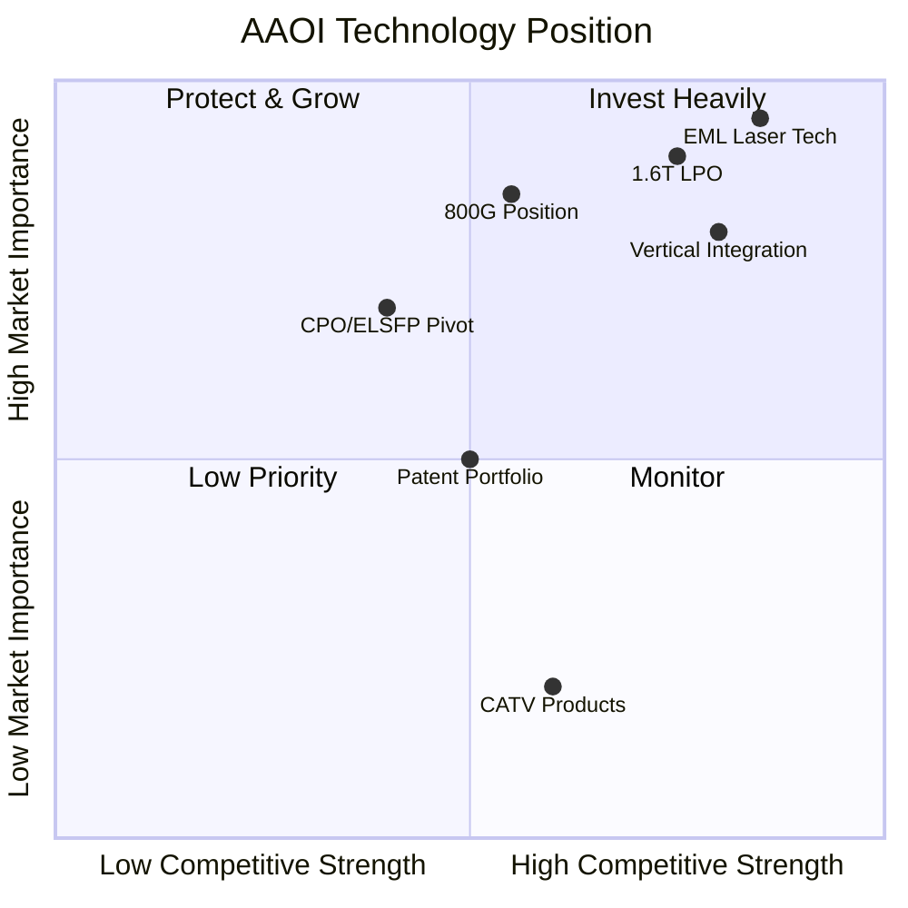

# AAOI — Technology Edge & Competitive Moat

> [!abstract] Bottom Line
> AAOI's moat is **vertical InP laser fabrication** (1 of ~5 globally) plus a **1.6T OSFP DR8 LPO** module that shipped months before COHR/LITE could match it — anchoring its first volume 1.6T order (>$200M, March 2026). The open question is durability: NVIDIA has routed **~$6B** to three peers (Coherent, Lumentum, Marvell), InnoLight still owns 800G volume share, and CPO sits on the 2027-2028 horizon. AAOI's 349-patent portfolio is small vs COHR (7,346) and LITE (3,160), but it is focused squarely on the EML/LPO/200G-per-lane technology that the current upgrade cycle actually needs.

---

## The Core Moat: Vertical Integration

AAOI is one of **~5 companies globally** that controls the entire optical transceiver stack from raw semiconductor wafer to finished module. Most competitors buy lasers from third parties.



---

## Crown Jewel: EML Technology

**EML = Electro-absorption Modulated Laser**

An EML monolithically integrates a laser diode AND an optical modulator on a single InP chip. This is extremely difficult to manufacture but provides critical advantages at high data rates.

```text
    ┌───────────────────────────────────────────────────────────┐
    │              EML vs DML Comparison                         │
    ├───────────────┬───────────────────┬───────────────────────┤
    │ Metric        │ EML (AAOI's edge) │ DML (simpler)         │
    ├───────────────┼───────────────────┼───────────────────────┤
    │ Max Speed     │ 100Gbaud+ (PAM4)  │ ~50Gbaud (limited)    │
    │ Signal Quality│ Superior (low     │ Inferior (high chirp) │
    │               │ chirp, high ER)   │                       │
    │ Power         │ Lower at high     │ Higher at high speed   │
    │               │ speeds            │                       │
    │ Reach         │ 2km+ (FR4)        │ <500m typically       │
    │ Cost          │ Higher per chip   │ Lower per chip        │
    │ Complexity    │ Very high         │ Moderate              │
    │ Who needs it  │ 800G, 1.6T        │ Legacy 100G/400G     │
    ├───────────────┴───────────────────┴───────────────────────┤
    │ BOTTOM LINE: EMLs are REQUIRED for next-gen 800G/1.6T    │
    │ transceivers. AAOI is one of ~5 companies that can make  │
    │ them at production scale.                                 │
    └───────────────────────────────────────────────────────────┘
```

**Companies with production-grade InP EML capability:**
1. AAOI (Applied Optoelectronics)
2. Coherent Corp (formerly II-VI/Finisar)
3. Lumentum Holdings
4. Mitsubishi Electric
5. A handful of Japanese/Chinese labs

---

## Product Roadmap & Speed Migration

```text
    TRANSCEIVER SPEED EVOLUTION
    ═══════════════════════════════════════════════════════

    100G ──── 400G ──── 800G ──── 1.6T ──── 3.2T
     │         │         │         │         │
     │         │         │         │         └── 2028+
     │         │         │         └── 2026 (AAOI shipping!)
     │         │         └── 2025-2026 (ramping)
     │         └── 2022-2024 (mature, commoditizing)
     └── Legacy (declining)

    ASP TREND:
    100G: $15-25     (commodity)
    400G: $60-100    (declining)
    800G: $150-250   (growth phase)
    1.6T: $400+      (early premium)

    ┌─────────────────────────────────────────────────────┐
    │ AAOI's KEY WIN: First volume 1.6T LPO shipments    │
    │ began March 2026 — MONTHS ahead of larger peers     │
    │ $200M+ initial order from major hyperscaler         │
    └─────────────────────────────────────────────────────┘
```

### 1.6T OSFP DR8 LPO — Product Specs (ECOC 2024 Demo)

| Spec | Value |
|---|---|
| Form Factor | OSFP (standard) |
| Lane Config | **8x200G PAM4** (DR8) |
| Total Rate | 1.6 Tbps |
| Power | **MAX 10W** (vs ~20W DSP = 50% savings) |
| Architecture | SiPh optical engine + linear laser drivers (NO DSP) |
| Connectors | Dual MPO-12 APC, hot-pluggable |
| Reach | ~500m single-mode fiber |
| Standards | OIF CEI-224G Linear, CMIS Rev 4.0 |

**LPO removes the DSP** — saves >25% of BOM cost, 50% power, and reduces latency. Ideal for GPU-to-switch links in AI clusters.

### OFC 2026: 25 dBm ELSFP (External Laser Source)

AAOI demonstrated a **400mW ultra-high-power CW laser** in a pluggable ELSFP form factor for Co-Packaged Optics. This is AAOI's **hedge against CPO** — even if pluggable modules decline, laser sources are still needed. Live 6.4T optical backplane demo at OFC.

---

## AI Data Center Demand Thesis

```text
    WHY AI = MASSIVE OPTICAL TRANSCEIVER DEMAND
    ════════════════════════════════════════════

    GPU Cluster (10K-100K GPUs)
         │
         ├── Each GPU needs 400G-800G optical links
         │   for spine-leaf connectivity
         │
         ├── Bandwidth per GPU INCREASING faster
         │   than GPU count (multiplicative demand)
         │
         ├── 400G → 800G → 1.6T upgrade cycle
         │   drives ASP uplift per port
         │
         └── Hyperscalers (AMZN, MSFT, META, GOOG)
             are ALL building massive AI clusters

    ┌─────────────────────────────────────────────┐
    │ ONE NVIDIA DGX B200 SYSTEM:                 │
    │                                             │
    │   8 GPUs × 800G optical link = 6.4 Tbps     │
    │   per system of optical interconnect         │
    │                                             │
    │ A 100K GPU CLUSTER needs:                   │
    │   ~50,000+ optical transceivers             │
    │   at 800G = $7.5M-12.5M in optics ALONE    │
    └─────────────────────────────────────────────┘
```

---

## Technology Risks

### 1. Silicon Photonics (SiPh) Threat

```text
    III-V Lasers (AAOI)          vs          Silicon Photonics
    ┌──────────────────────┐      ┌──────────────────────┐
    │ + Superior laser     │      │ + CMOS-compatible    │
    │   performance        │      │ + Integration with   │
    │ + Lower power at     │      │   electronics        │
    │   high speeds        │      │ + Potentially cheaper│
    │ + Proven at 800G     │      │   at extreme volume  │
    │                      │      │                      │
    │ - Expensive fabs     │      │ - Still needs III-V  │
    │ - Not CMOS-          │      │   laser source!      │
    │   compatible         │      │ - Higher power MZMs  │
    │ - Lower volume       │      │ - Yield challenges   │
    └──────────────────────┘      └──────────────────────┘

    VERDICT: SiPh is NOT an existential threat because it still
    needs III-V lasers. AAOI could pivot to become a laser
    source supplier to SiPh platforms.
```

### 2. Co-Packaged Optics (CPO) Disruption

```text
    TODAY (Pluggable)              FUTURE? (CPO)
    ┌─────────┐ ┌─────────┐      ┌─────────────────────┐
    │  ASIC   │ │Transceiver│     │   ASIC + Optics     │
    │         │←→│(AAOI)    │     │   soldered together  │
    │  (hot-  │ │(hot-swap)│      │   (NOT hot-swap)    │
    │  swap)  │ │          │      │                     │
    └─────────┘ └─────────┘      └─────────────────────┘

    CPO Timeline: 2027-2028+ for mainstream
    Current: Pluggable dominates through at least 2027

    Why CPO is slow:
    - Serviceability: hyperscalers HATE non-swappable parts
    - Thermal: 500W ASICs + temperature-sensitive lasers = hard
    - Lock-in: CPO ties you to one optical vendor per ASIC
```

### 3. InnoLight Pricing Pressure

```text
    InnoLight (Chinese competitor):
    - Largest transceiver company by VOLUME globally
    - 40-50% cheaper ASPs than Western competitors
    - Major supplier to Meta/Facebook
    - Dominant 800G market share
    - Establishing Thailand/Vietnam facilities for tariff avoidance

    AAOI's defense:
    - Vertical integration = lower internal laser cost
    - US manufacturing = tariff advantage (post Supreme Court ruling)
    - Customer relationships at Amazon/Microsoft
    - EML technology for 1.6T advantage
```

---

## Patent Portfolio & IP Enforcement

```text
    PATENT PORTFOLIO (as of Dec 31, 2025)
    ═══════════════════════════════════════

    US Patents:          199
    China & Taiwan:      140
    Europe:               10
    ─────────────────────────
    TOTAL:               349 issued patents
    Expiry range:        2026-2046

    COMPARISON:
    AAOI:      349 patents  ██
    Lumentum:  3,160 patents  ██████████████████
    Coherent:  7,346 patents  ██████████████████████████████████████

    Small portfolio BUT strategically focused on InP EML/DML
    and transceiver packaging — the exact technology in demand.
```

### Active IP Lawsuits (Offensive — AAOI as Plaintiff)

| Date | Defendant | Status | Signal |
|---|---|---|---|
| Sep 2023 | **Molex** | **Settled Jun 2024** (confidential) | Validates patent value |
| Feb 2024 | **Cambridge Industries (CIG)** | Pending | Chinese competitor |
| Nov 2024 | **Eoptolink Technology** | Pending | Chinese 400G competitor |
| Dec 2024 | **Accelight Technologies** | Pending | Chinese competitor |

> [!info]
> AAOI is **aggressively enforcing** patents against Chinese transceiver makers. The Molex settlement likely included a licensing arrangement. This is a strategic moat-building and monetization campaign.

---

## R&D Profile

| Metric | FY2023 | FY2024 | FY2025 |
|---|---|---|---|
| R&D Spend | $36.0M | $55.0M | **$85.5M** |
| As % of Revenue | 16.5% | 22.0% | 18.8% |
| R&D Employees | — | — | **425** (incl 14 PhDs) |
| Total Employees | — | — | 4,691 |

**R&D spending up 138% in 2 years.** Concentrated on InP EML, 1.6T LPO, and 200G/lane technology.

### Key R&D Personnel

| Name | Role | Background | Patents |
|---|---|---|---|
| Dr. Thompson Lin | Founder/CEO | Ph.D. U of Missouri. Former research prof U of Houston | Company founder |
| Dr. Klaus Anselm | VP Semiconductor | Ph.D. UT Austin (1997). Ex-Bell Labs/Lucent MBE research. At AOI since 1999 | **23 US patents**, 40+ publications |
| Dr. Stefan Murry | CFO/CSO | Ph.D. Technical + strategic dual role | — |
| Dr. Fred Chang | SVP NA GM | Ph.D. Optical Component BU lead since 2012 | — |

### OFC 2026 Demonstrations (March 2026, Los Angeles)

- **25 dBm ultra-high power External Laser Source (ELS)** — 400mW CW for CPO/NPO architectures
- **6.4T optical backplane** live demonstration
- Investor session March 17, 2026

---

## Technology Timeline



---

## Technology Edge Summary



| Factor | Rating | Trend | Detail |
|---|---|---|---|
| EML laser technology | **Strong moat** | Strengthening | 1 of ~5 companies globally |
| Vertical integration | **Strong moat** | Strengthening | Sugar Land mega-expansion |
| 1.6T LPO first-mover | **Leading** | New advantage | First volume 1.6T order >$200M (Mar '26), months ahead of COHR/LITE |
| 800G market position | Catching up | Improving | $124M 800G orders from one hyperscaler since mid-March '26 |
| CPO/ELSFP readiness | Moderate | Hedge in place | 25 dBm / 400 mW CW laser in ELSFP form factor at OFC 2026 |
| Patent enforcement | Active | Ongoing | 4 lawsuits vs Chinese competitors (Molex settled 2024) |
| InnoLight defense | Weak on price | Strong on tech | InnoLight still ~10x revenue; dominant 800G volume share |
| NVIDIA alignment | **Gap** | Widening | NVIDIA committed ~$6B to COHR/LITE/MRVL (none to AAOI) |

> [!warning] NVIDIA Gap
> NVIDIA has committed **~$6B to three AAOI peers** (not AAOI): $2B in Coherent (Mar 2026), $2B in Lumentum (Mar 2026), and $2B in Marvell (Mar 31, 2026, tied to NVLink Fusion + 1.6T silicon photonics for the "Rubin" platform). This gives COHR/LITE/MRVL a strategic NVIDIA alignment and purchase commitments that AAOI lacks. AAOI's Amazon warrant ($4B to 2035) partially offsets on the customer side — but not on the GPU-vendor side, which matters for reference-design capture.

#AAOI #technology #EML #AI #optics #LPO #patents
