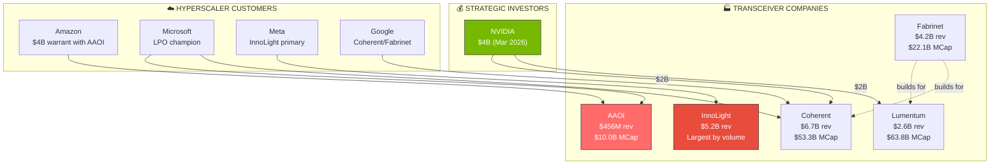

# AAOI — Competitor Analysis

> [!abstract] Bottom Line (2026-04-09)
> - **NVIDIA's $4B photonics bet** (Mar 2 2026: $2B each into COHR + LITE) is THE structural overhang — AAOI is the one pure-play not on the list
> - AAOI is the **smallest by MCap, fastest-growing, highest-beta, and now HIGHEST-IV-rank** (97.8%, not the lowest — this corrects a prior claim)
> - **InnoLight (CNY 38.24B ≈ $5.2B rev, +60% YoY)** is the global volume leader and AAOI's #1 competitive threat ex-US
> - AAOI's moat: US manufacturing (Sugar Land), in-house EML/VCSEL, 1.6T first-mover. Loses on scale, profitability, customer concentration.
> - At **$136/$10B MCap**, AAOI trades at ~21.9x TTM P/S vs peers at 3–12x — richest sector multiple, entirely a growth bet.

---

## Competitive Ecosystem



---

## Competitive Landscape Map

```text
    OPTICAL TRANSCEIVER COMPETITIVE POSITIONING
    ══════════════════════════════════════════════════════════════

                        HIGH INTEGRATION
                             ▲
                             │
                    AAOI ●   │  ● Coherent (COHR)
                             │
                             │     ● Lumentum (LITE)
                             │       (components only)
                             │
    SMALL REVENUE ◄──────────┼──────────► LARGE REVENUE
                             │
                    ● Source  │
                    Photonics │  ● InnoLight
                             │    (Chinese giant)
                             │
                    ● Eoptolink  ● Cisco/Acacia (SiPh)
                             │
                             ▼
                        LOW INTEGRATION
                        (buy lasers)
```

---

## Head-to-Head Comparison (Unusual Whales Data — 2026-04-09)

### Financial Metrics

| Metric | AAOI | COHR | LITE | FN | TSEM |
|---|---|---|---|---|---|
| **Market Cap** | **$10.0B** | $53.3B | $63.8B | $22.1B | $22.7B |
| **Revenue (FY)** | $456M | ~$6.7B | ~$2.6B | ~$3B | ~$1.8B |
| **Rev Growth** | **+83%** | +17% (Q2) | +65.5% (Q2) | +19% | ~20% |
| **Gross Margin (non-GAAP)** | 30% | 39.0% | 42.5% | ~12% | ~25% |
| **Beta** | **3.95** | 2.70 | 2.43 | 2.57 | 2.00 |
| **IV** | **159.8%** | 99.0% | 106.2% | 91.9% | 84.9% |
| **IV Rank (1Y)** | **97.8%** | 77.5% | 87.7% | 96.6% | 82.4% |
| **Avg 30d Vol** | 13.5M | 8.8M | 7.2M | 674K | 3.9M |
| **Shares Out** | 75.2M | 187.5M | 71.4M | 35.8M | 111.6M |
| **Forward P/E** | **~145x** | ~45x | ~60x | ~22x | ~25x |
| **P/S (trailing)** | **~21.9x** | ~8x | ~12x | ~3x | ~6x |
| **Dividend** | No | No | No | No | Yes |
| **Next Earnings** | May 14 | May 6 | May 5 | May 4 | May 13 |

> [!important] Correction from prior vault
> AAOI now has the **HIGHEST IV AND among the HIGHEST IV Rank** in the group (97.8%, near 1Y high). Earlier "lowest IV Rank" claim is obsolete after the April 7–9 rip. Only FN (96.6%) is close. IV expansion room is now minimal — vol is already priced for earnings.

### Technology Capabilities

```text
    TECHNOLOGY COMPARISON MATRIX
    ═════════════════════════════════════════════════════

                    AAOI  COHR  LITE  FN    InnoLight  Cisco
    ──────────────────────────────────────────────────────────
    InP EML Fab     ████  ████  ████  ░░░░  ░░░░       ░░░░
    GaAs VCSEL      ████  ████  ████  ░░░░  ░░░░       ░░░░
    MOCVD In-House  ████  ████  ████  ░░░░  ░░░░       ░░░░
    Silicon Photonics░░░░ ████  ░░░░  ░░░░  ░░░░       ████
    Module Assembly ████  ████  ░░░░  ████  ████       ████
    Coherent DSP    ░░░░  ████  ██░░  ░░░░  ░░░░       ████
    400G Shipping   ████  ████  ████  ████  ████       ████
    800G Shipping   ████  ████  ████  ████  ████       ████
    1.6T Shipping   ████  ██░░  ░░░░  ░░░░  ██░░       ██░░
    CPO Ready       ░░░░  ██░░  ░░░░  ░░░░  ░░░░       ████

    ████ = Strong    ██░░ = Developing    ░░░░ = None/Weak
```

---

## Competitor Deep Dives

### Coherent Corp (COHR) — The Strongest Competitor

```text
    ┌──────────────────────────────────────────────────────────┐
    │ COHERENT (formerly II-VI + Finisar)                      │
    │                                                          │
    │ Q2 FY2026: $1.69B rev (+17% YoY reported)                │
    │ MCap: $53.3B   Non-GAAP GM: 39.0%   Non-GAAP EPS: $1.29  │
    │ GAAP diluted EPS: $0.76   Q2 CapEx: $154M                │
    │ S&P 500 member                                            │
    │                                                          │
    │ NVIDIA $2B INVESTMENT (Mar 2, 2026): US silicon          │
    │ photonics manufacturing + R&D partnership                │
    │                                                          │
    │ DC & Comms: $1.2B (72% of rev, +34% YoY)                │
    │ 300M+ transceivers shipped from Ipoh, Malaysia            │
    │ 800G EML + 1.6T SiPh both shipping                       │
    │ Booking visibility extending into 2028                    │
    │                                                          │
    │ STRENGTHS vs AAOI:                                        │
    │ + ~15x larger revenue base                                │
    │ + Full vertical: InP + SiPh + SiC substrates             │
    │ + NVIDIA $2B strategic partner                            │
    │ + S&P 500 = passive fund flows                            │
    │ + Sells CW lasers to OTHER SiPh makers (picks & shovels) │
    │                                                          │
    │ WEAKNESSES vs AAOI:                                       │
    │ - Slower reported growth (+17% vs AAOI +83%)              │
    │ - GAAP margin dragged by amortization                    │
    │ - Heavy insider selling throughout 2025-26                │
    └──────────────────────────────────────────────────────────┘
```

### Lumentum (LITE) — Component Supplier, NVIDIA Partner

```text
    ┌──────────────────────────────────────────────────────────┐
    │ LUMENTUM HOLDINGS                                        │
    │                                                          │
    │ Q2 FY2026: $665.5M rev (+65.5% YoY)                      │
    │ MCap: $63.8B   Non-GAAP GM: 42.5%   Non-GAAP EPS: $1.67 │
    │ GAAP diluted EPS: $0.89   EPS beat by +35.8%             │
    │                                                          │
    │ NVIDIA $2B INVESTMENT (Mar 2, 2026): R&D, US fab         │
    │ build-out, future capacity rights for laser components   │
    │                                                          │
    │ Components: $443.7M (+68% YoY)                           │
    │ Systems (transceivers): $221.8M (+60% YoY)               │
    │ Non-GAAP op margin expanded >1,700 bps YoY               │
    │                                                          │
    │ STRENGTHS:                                                │
    │ + Highest GM in peer set (42.5% non-GAAP)                │
    │ + NVIDIA $2B strategic investment                         │
    │ + Market-leading 200G/lane EML for 1.6T                  │
    │ + Thailand flagship fab (tariff-safe)                    │
    │                                                          │
    │ WEAKNESSES:                                               │
    │ - ~25x P/S = most expensive in sector                    │
    │ - Heavy insider selling through 2026                      │
    └──────────────────────────────────────────────────────────┘
```

### Fabrinet (FN) — Contract Manufacturer

```text
    ┌──────────────────────────────────────────────────────────┐
    │ FABRINET                                                 │
    │                                                          │
    │ Revenue: ~$3B         MCap: $22.1B                       │
    │ Gross Margin: ~12%    Profitable: YES (consistently)     │
    │                                                          │
    │ BUSINESS MODEL: Contract manufacturer — builds other     │
    │ companies' optical products. No proprietary technology.  │
    │ Thailand-based = zero tariff exposure.                   │
    │                                                          │
    │ STRENGTHS:                                                │
    │ + Only consistently profitable optical company            │
    │ + Asset-light model (low CapEx)                           │
    │ + Thailand manufacturing = tariff immune                  │
    │ + Diversified customer base                               │
    │ + ROE ~20%+ (best in class)                               │
    │                                                          │
    │ WEAKNESSES:                                               │
    │ - No proprietary technology (just builds for others)      │
    │ - Thin margins (12% gross)                                │
    │ - Dependent on customer design wins                       │
    │ - Can be replaced by other contract manufacturers         │
    └──────────────────────────────────────────────────────────┘
```

### InnoLight Technology — The Chinese Giant (300308.SZ)

```text
    ┌──────────────────────────────────────────────────────────┐
    │ INNOLIGHT (Zhongji Innolight, Suzhou-based)              │
    │                                                          │
    │ 2025 Revenue: CNY 38.24B (~$5.2B) +60% YoY              │
    │ 2024 Revenue: CNY 23.86B (~$3.3B) +123% YoY             │
    │ Net Margin: 20-22%                                        │
    │ 86.8% of revenue from overseas markets                    │
    │                                                          │
    │ NOW THE LARGEST TRANSCEIVER COMPANY GLOBALLY BY REVENUE  │
    │                                                          │
    │ DOMINANCE:                                                │
    │ + InnoLight + Eoptolink = ~60% of NVIDIA's 800G orders   │
    │ + InnoLight alone = 50-60% of 1.6T module market         │
    │ + First to complete 1.6T testing with NVIDIA              │
    │ + Meta increasing optical budget 90% in 2025 (InnoLight) │
    │ + 20-25% cheaper than Western competitors (not 40-50%)   │
    │                                                          │
    │ TARIFF MITIGATION:                                        │
    │ + 70,000+ sq meter Thailand factory (400G/800G capable)  │
    │ + "China design + SE Asia manufacturing" strategy         │
    │ + Substantial transformation rules = avoids tariffs       │
    │                                                          │
    │ VULNERABILITIES:                                          │
    │ + US DSP chokepoint: Depends on Broadcom/Marvell 5nm DSPs│
    │ + Entity-level targeting risk (not just country-of-origin)│
    │ + DOJ ramping tariff evasion enforcement in 2026          │
    │ + Section 301 Thai/Vietnam mfg investigations (Mar 2026) │
    │                                                          │
    │ IF US TARGETS INNOLIGHT BY ENTITY (not just origin):     │
    │ Thailand strategy fails → AAOI's biggest catalyst         │
    └──────────────────────────────────────────────────────────┘
```

---

## Competitive Positioning on Key Dimensions

### Manufacturing Geography Risk

```text
    TARIFF/GEOPOLITICAL SAFETY SCORE (10 = safest)

    Fabrinet      ██████████  10/10  (Thailand only)
    Lumentum      █████████░   9/10  (Thailand/Japan/US)
    Cisco/Acacia  ████████░░   8/10  (US/Thailand)
    Coherent      ███████░░░   7/10  (Diversified but some China)
    AAOI (2027)   ███████░░░   7/10  (Sugar Land pivot complete)
    AAOI (today)  ████░░░░░░   4/10  (Still 40-60% Ningbo)
    InnoLight     ██░░░░░░░░   2/10  (100% China)
```

### Growth Rate Ranking

```text
    REVENUE GROWTH (LATEST FY)

    AAOI          ████████████████████████████████████  +83%
    InnoLight     ██████████████████████████░░░░░░░░░░  ~50%
    Lumentum      ████████████████████░░░░░░░░░░░░░░░░  +49%
    Coherent      ████████████░░░░░░░░░░░░░░░░░░░░░░░░  ~30%
    Fabrinet      ████████░░░░░░░░░░░░░░░░░░░░░░░░░░░░  +19%
```

### Valuation Premium

```text
    P/S RATIO (TRAILING) — updated at spot 2026-04-09

    AAOI          ████████████████████████████████████  ~21.9x ← RICHEST
    Lumentum      ██████████████████████░░░░░░░░░░░░░░  ~24.5x
    Coherent      █████████░░░░░░░░░░░░░░░░░░░░░░░░░░░  ~8x
    Fabrinet      ████░░░░░░░░░░░░░░░░░░░░░░░░░░░░░░░░  ~3x

    AAOI and LITE are the two priced-for-perfection names.
    LITE has NVDA $2B backing + 42.5% GM; AAOI has +83% growth
    but is unprofitable. Both need flawless CY26-27 execution.
```

---

## AAOI's Sustainable Advantages

```text
    ┌──────────────────────────────────────────────────────────┐
    │ WHERE AAOI WINS                                          │
    ├──────────────────────────────────────────────────────────┤
    │                                                          │
    │ 1. EML LASER TECHNOLOGY                                  │
    │    Only ~5 companies globally can make production-grade  │
    │    InP EMLs. This is THE technology for 800G/1.6T.       │
    │                                                          │
    │ 2. VERTICAL INTEGRATION COST                             │
    │    Making lasers internally saves 30-50% on the most     │
    │    expensive component. At scale, this is a margin moat. │
    │                                                          │
    │ 3. 1.6T FIRST MOVER                                     │
    │    Shipping 1.6T LPO months ahead of larger competitors. │
    │    Early design wins lock in multi-year revenue.          │
    │                                                          │
    │ 4. US MANUFACTURING (by 2027)                            │
    │    Sugar Land facility = tariff-proof, trusted supplier,  │
    │    potential defense qualification path.                  │
    │                                                          │
    │ 5. GROWTH RATE                                            │
    │    83% revenue growth = fastest in the sector.           │
    │    AI demand is driving a generational upgrade cycle.     │
    └──────────────────────────────────────────────────────────┘

    ┌──────────────────────────────────────────────────────────┐
    │ WHERE AAOI LOSES                                         │
    ├──────────────────────────────────────────────────────────┤
    │                                                          │
    │ 1. SCALE: 10x smaller than Coherent, 2x smaller         │
    │    than InnoLight by revenue                             │
    │                                                          │
    │ 2. PROFITABILITY: Only company in group that has         │
    │    NEVER been consistently profitable                    │
    │                                                          │
    │ 3. CUSTOMER CONCENTRATION: Top 3 = 60-80% of revenue    │
    │    Peers are more diversified                             │
    │                                                          │
    │ 4. BALANCE SHEET: Funded by dilution, not earnings       │
    │    Peers have stronger financial foundations              │
    │                                                          │
    │ 5. PRICING POWER: InnoLight undercuts by 40-50%          │
    │    AAOI must compete on technology, not price             │
    └──────────────────────────────────────────────────────────┘
```

---

## Insider Activity Comparison (All Net Sellers)

| Metric | AAOI | COHR | LITE | FN | TSEM |
|---|---|---|---|---|---|
| **Recent Direction** | HEAVY SELL | HEAVY SELL | HEAVY SELL | SELL ONLY | SELL (minimal) |
| **Notable** | **~$63.5M sold 2025–26** (incl. ~$53.9M in Mar 2026 at $94–113). CEO Lin is net buyer (~$1.7M at ~$21) | Nov–Dec 2025 massive blocks. Continued at $240+ | $74M sold Feb 2026 by 2 insiders at $550–690 | Consistent selling at $450–624. Zero buys EVER | 1 sale only: 64K shares Nov 2025 |
| **Any Buying?** | Yes (Lin at ~$21) | Small ($72K, $51K) | None | **None on record** | None |

> [!note]
> Prior vault said "$27M+" for AAOI selling — that's materially understated. Canonical UW data: **31 sells totaling -$65.1M notional vs 4 buys of $1.66M**.

```text
    INSIDER CONVICTION RANKING (best to worst)
    ═══════════════════════════════════════════

    AAOI     ████████████████░░░░  CEO is net buyer (unique!)
    TSEM     ████████░░░░░░░░░░░░  Minimal activity either way
    COHR     ████░░░░░░░░░░░░░░░░  Heavy selling, tiny buys
    LITE     ██░░░░░░░░░░░░░░░░░░  Heavy selling, no buys
    FN       ░░░░░░░░░░░░░░░░░░░░  Pure selling, ZERO buys ever
```

---

## Seasonality Comparison

```text
    BEST MONTH: NOVEMBER (universal across all 5 tickers!)
    ════════════════════════════════════════════════════════

    AAOI   Nov: +11.4% avg, 63% win rate
    COHR   Nov:  +7.8% avg, 82% win rate
    LITE   Nov: +11.3% avg, 80% win rate
    FN     Nov: +10.4% avg, 87% win rate  ← highest win rate
    TSEM   Nov:  +6.1% avg, 67% win rate

    WORST MONTH: MARCH-APRIL (sector-wide weakness)
    ════════════════════════════════════════════════════════

    AAOI   Mar: -24.7% avg, 13% win rate  ← DEVASTATING
    COHR   Mar:  -1.5% avg, 50% win rate
    LITE   Apr:  -5.3% avg, 30% win rate
    FN     Apr:  -1.7% avg, 40% win rate
    TSEM   Jun:  -2.3% avg, 33% win rate
```

---

## Top 3 Institutional Holders

| Rank | AAOI | COHR | LITE | FN | TSEM |
|---|---|---|---|---|---|
| #1 | BlackRock (5.3M) | **Fidelity (23.6M)** | **Fidelity (9.3M)** | BlackRock (5.6M) | Clal Insurance (4.8M) |
| #2 | Vanguard (5.0M) | Vanguard (16.1M) | BlackRock (8.3M) | Vanguard (4.1M) | T. Rowe Price (4.7M) |
| #3 | **Invesco (3.5M)** | BlackRock (14.5M) | Vanguard (7.4M) | T. Rowe Price (4.0M) | Vanguard (4.3M) |

> [!note]
> Fidelity dominates COHR and LITE. AAOI's standout is Invesco's 53x position increase. TSEM's #1 is Clal Insurance (Israeli) reflecting Tower's Israeli roots.

---

## Which Stock to Own? (Framework)

```text
    IF YOU BELIEVE:                          OWN:
    ═══════════════════════════════════════════════════
    AI transceiver boom is real, want       AAOI (highest
    maximum upside, can tolerate risk       beta, growth)

    AI boom is real but want safety         COHR (diversified,
    and diversification                     larger, profitable)

    Want optical exposure with              FN (profitable,
    lowest risk                             asset-light, Thailand)

    Want component-level pure play          LITE (highest margins,
    without module competition              upstream supplier)

    Want foundry/photonics exposure         TSEM (lowest beta,
    with dividend                           Israeli photonics fab)

    Want to bet against Chinese             AAOI + COHR
    optical dominance                       (US manufacturing)
```

#AAOI #competitors #COHR #LITE #FN #TSEM #InnoLight
