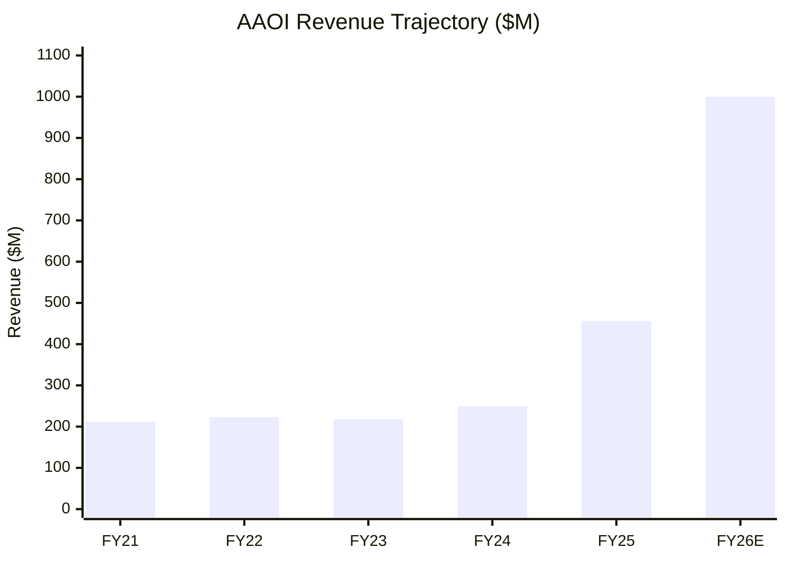
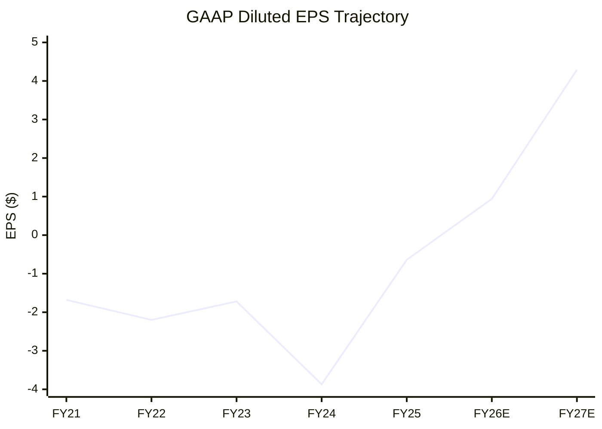

# AAOI — Financials, CapEx & Valuation

> [!abstract] Bottom Line (as of 2026-04-09 close: **$136.05**)
> - **MCap $10.0B** on $456M FY25 revenue → **~21.9x trailing P/S** (vs peers at 3–12x)
> - **Forward P/E $136 / $0.94 = ~144.7x** — priced for flawless 1.6T execution
> - FY2025 GAAP EPS **-$0.64** (diluted; UW API's -$0.28 is a different calc basis)
> - **Rosenblatt $140 PT is now ~3% above spot** — Street's most bullish PT is nearly tagged
> - FY2025 CapEx **$179M** (mgmt call cited ~$209M total capital investment); FY25 FCF **-$354M**; funded by **$508M equity raise**
> - Cumulative losses FY21–25: **-$401M**. First-ever profit year hinges on FY26 execution.

---

## Revenue Trajectory



| Year | Revenue | YoY Growth | Gross Margin | Net Income |
|---|---|---|---|---|
| FY2021 | $211.6M | — | 17.8% | ($54.2M) |
| FY2022 | $222.8M | +5.3% | 15.1% | ($66.4M) |
| FY2023 | $217.7M | -2.3% | 27.1% | ($56.1M) |
| FY2024 | $249.4M | +14.6% | 24.8% | ($186.7M) |
| **FY2025** | **$455.7M** | **+82.8%** | **30.0%** | **($38.2M)** |
| **FY2026E** | **>$1,000M** | **+120%** | **32–38%** | **+$120M op profit** |

### Quarterly Acceleration (FY2025)

| Quarter | Revenue | QoQ Growth |
|---|---|---|
| Q1 2025 | $99.8M | — |
| Q2 2025 | $103.0M | +3.2% |
| Q3 2025 | $118.6M | +15.1% |
| Q4 2025 | $134.3M (record) | +13.2% |
| **Q1 2026 Guide** | **$150–165M** | **+16%** |

---

## Gross Margin Trend

```text
    Gross Margin (%)

    35% ─ ─ ─ ─ ─ ─ ─ ─ ─ ─ ─ ─ ─ ─ ─ ─ ─ ─ ─ ─ ─ ─ ─ ▪ 31.2% (Q4)
    30% ─────────────────────────────────────────── 30.0% ──
    27% ─────────────────── 27.1% ─────────────────────────
    25% ──────────────────────────── 24.8% ────────────────
    18% ── 17.8% ──────────────────────────────────────────
    15% ─────── 15.1% ────────────────────────────────────
        FY21   FY22   FY23   FY24   FY25   Q4'25

    DRIVER: Shift from low-margin CATV to high-margin 800G datacenter
```

---

## The CapEx Hockey Stick

```text
    CapEx ($M) — 22x increase in 2 years
    ════════════════════════════════════════════════════════

    FY25  │████████████████████████████████████████  $179M  (39.3% of rev)
    FY24  │█████████                                  $43M  (17.4% of rev)
    FY23  │██                                          $8M  ( 3.6% of rev)
    FY22  │█                                           $3M  ( 1.4% of rev)
    FY21  │██                                          $8M  ( 3.8% of rev)
    ────────────────────────────────────────────────────────
    FY21-23: STARVATION (CapEx < D&A → shrinking asset base)
    FY24-25: EXPLOSION (~85% growth capex for 800G/1.6T)
    Mgmt Q4 call: ~$209M total capital investment in 2025
    (delta vs $179M GAAP = non-CapEx capital commitments)
```

### What's the CapEx Going Toward?

| Investment | Amount | Purpose |
|---|---|---|
| Sugar Land Expansion | $300M | 210K sq ft AI transceiver mega-facility |
| MOCVD Reactors | $5–10M each | Epitaxial wafer growth for laser chips |
| 800G/1.6T Production Lines | ~$50M+ | Automated transceiver assembly |
| Taiwan Expansion | ~$20M+ | Packaging and testing capacity |
| Test Equipment | ~$10M+ | Qualification for hyperscaler specs |

**Target**: 500,000 units/month of 800G+1.6T by end of 2026

---

## Profitability (or Lack Thereof)

```text
    Net Income ($M)

    $0  ─ ─ ─ ─ ─ ─ ─ ─ ─ ─ ─ ─ ─ ─ ─ ─ ─ ─ ─ ─ ─ ─ ─ ─ ─ ─
                                                         -$38
    -$54  ██
    -$56  ██           ██
    -$66  ██    ██     ██
                ██     ██
                       ██
    -$187 ██    ██     ██     ██
          FY21  FY22  FY23  FY24                        FY25

    Q4 2025 EPS: -$0.01 (beat estimate of -$0.13 by 92%)
    THE COMPANY IS AT THE INFLECTION POINT TOWARD PROFITABILITY

    Cumulative losses FY2021-2025: -$401M
```

### EPS Forward Estimates

| Period | EPS | P/E at $136 |
|---|---|---|
| FY2025 (actual, GAAP diluted) | ($0.64) | N/M |
| FY2026E (consensus) | ~$0.94 | **~144.7x** |
| FY2027E | ~$4.29 | ~31.7x |



> [!info] EPS Reconciliation
> FY25 GAAP diluted loss/share = -$0.64 per company filings ($38.2M loss on weighted avg ~60M shares). Unusual Whales API returns -$0.28 (likely non-GAAP or share-count basis). Vault uses GAAP per 10-K.

---

## Return on Retained Earnings (RORE)

```text
    RORE = Change in EPS / Change in Book Value per Share

    ┌──────────────────────────────────────────────────────┐
    │ VERDICT: RORE IS DEEPLY NEGATIVE                     │
    │                                                      │
    │ - 13 consecutive years of negative ROE               │
    │ - Cumulative losses of -$401M over 5 years           │
    │ - Equity grew only through EXTERNAL capital raises   │
    │   ($508M raised in FY2025 alone)                     │
    │ - Book value recovery is from dilutive issuance      │
    │   at prices above book, NOT from earnings            │
    │                                                      │
    │ RORE flips positive IF FY2026 achieves profitability │
    │ This would be the FIRST TIME in company history      │
    └──────────────────────────────────────────────────────┘
```

### ROE History

| Year | ROE | Trend |
|---|---|---|
| FY2021 | -21.3% | — |
| FY2022 | -35.9% | Worsening |
| FY2023 | -26.5% | Improving |
| FY2024 | -81.5% | Impairment hit |
| FY2025 | -7.9% | **Rapidly improving** |
| 13-Year Median | -20.8% | — |

---

## Balance Sheet

| Metric | FY2025 | FY2024 | FY2023 |
|---|---|---|---|
| Cash & Equivalents | $206.1M | $67.4M | $45.4M |
| Total Debt | $214.7M | $171.6M | $105.6M |
| Net Debt | $8.6M | $104.2M | $60.2M |
| Total Assets | $1,168.0M | $547.0M | $389.2M |
| Shareholders' Equity | $733.9M | $229.1M | $214.9M |
| Book Value/Share | $12.19 | $5.52 | $6.73 |

### Debt Structure

- **2030 Convertible Notes (2.75%)**: $125M face, conversion at $43.31/share (deep ITM at $136 — **3.14x conversion price**)
- 2026 notes largely exchanged for 2030 notes (saved ~$2M/year interest)
- Verified: $125M aggregate, 2.75% coupon, 23.0884 shares per $1,000 = $43.31, matures Jan 15, 2030

---

## Dilution Warning

```text
    ┌──────────────────────────────────────────────────────────┐
    │                    SHARES OUTSTANDING                     │
    │                                                          │
    │  FY2023:  ~32M shares                                    │
    │  FY2024:  ~41M shares  (+28%)                            │
    │  FY2025:  ~77.7M shares (+90%)  ← SHARES DOUBLED        │
    │                                                          │
    │  FY2025 equity raised: $508.5M                           │
    │  ATM program: $500M authorized, $250M already sold       │
    │  Another $250M of potential dilution AUTHORIZED           │
    │                                                          │
    │  The company raised MORE equity in FY2025 than its       │
    │  entire market cap was worth 12 months earlier.           │
    └──────────────────────────────────────────────────────────┘
```

---

## Free Cash Flow

| FY | OCF ($M) | CapEx ($M) | FCF ($M) | FCF Margin |
|---|---|---|---|---|
| 2021 | ($11.6) | ($8.0) | ($19.6) | -9.3% |
| 2022 | ($14.0) | ($3.2) | ($17.2) | -7.7% |
| 2023 | ($0.7) | ($7.9) | ($8.6) | -3.9% |
| 2024 | ($69.5) | ($43.4) | ($112.9) | -45.3% |
| **2025** | **($174.4)** | **($179.2)** | **($353.6)** | **-77.6%** |

**FCF is deeply negative because the company is in maximum investment mode.**
Funded by $508M equity + debt. This is the bet — burn now, earn later.

---

## Valuation

### Current Multiples (Spot $136.05, MCap $10.0B)

| Metric | AAOI | COHR | LITE | FN |
|---|---|---|---|---|
| Forward P/E | **~144.7x** | ~45x | ~60x | ~22x |
| P/S (Trailing) | **~21.9x** | ~8x | ~12x | ~3x |
| NTM EV/EBITDA | **~65x** <!-- needs verification --> | ~28x | ~35x | ~18x |
| Revenue Growth | **+83%** | +17% (Q2) | +65.5% (Q2) | +19% |

```text
    VALUATION CONTEXT (at $136.05, MCap $10.0B):
    ┌──────────────────────────────────────────────────────────┐
    │ With $456M TTM revenue:  P/S = 21.9x  (RICH)            │
    │ With $1B FY26E revenue:  P/S = 10.0x  (IF EXECUTED)     │
    │ With $2.3B FY27E:        P/S = 4.4x   (CONSENSUS)       │
    │ With $4.5B mgmt implied: P/S = 2.2x   (BULL CASE)       │
    │                                                          │
    │ Stock historically traded 2–4x P/S during decline.      │
    │ Current ~22x embeds nearly perfect 1.6T execution.      │
    │ Rosenblatt $140 PT is now ~3% ABOVE spot.               │
    └──────────────────────────────────────────────────────────┘
```

### Full Analyst Coverage (6 Analysts)

| Firm | Analyst | Rating | Target | vs Spot $136 | Date |
|---|---|---|---|---|---|
| **Rosenblatt** | Mike Genovese | **Buy** | **$140** | **+2.9%** | Mar 9, 2026 |
| Needham | Ryan Koontz | Strong Buy | $80 | -41.2% (stale) | Feb 27, 2026 |
| B. Riley | David Kang | Hold | $54 | -60.3% (stale) | Feb 27, 2026 |
| Northland Capital | Tim Savageaux | Buy | $35 | -74.3% (stale) | Nov 17, 2025 |
| Raymond James | Simon Leopold | Outperform | $25 | -81.6% (stale) | Aug 8, 2025 |
| Wolfe Research | George Notter | Peer Perform | N/A | — | Jul 8, 2025 |

> [!warning] Critical
> Stock has now blown past EVERY analyst PT except Rosenblatt's $140 (raised from $125 after $200M 1.6T order). 5 of 6 coverage PTs are materially stale given the 30%+ move this week.

### Consensus Estimates

| Metric | Consensus | Management Guide |
|---|---|---|
| Q1 2026 Revenue | $160.2M | $150–165M |
| Q1 2026 EPS | $0.074 | ($0.09) to $0.00 |
| **FY2026 Revenue** | **$983.7M** | **"Over $1 billion"** |
| **FY2026 EPS** | **$0.94** | Op profit >$120M |
| **FY2027 Revenue** | **$2.30B** | Implied $4.5B run-rate |
| FY2027 EPS | $4.29 | — |

```text
    ┌──────────────────────────────────────────────────────────┐
    │ THE EXPECTATION ARBITRAGE                                │
    │                                                          │
    │ Consensus FY2026:  $984M    vs  Mgmt guide: "$1B+"       │
    │ Consensus FY2027:  $2.3B    vs  Rosenblatt:  $3.6B       │
    │                              vs  Mgmt implied: $4.5B     │
    │                                                          │
    │ If management executes, consensus has room to move up.   │
    │ Rosenblatt thesis: ~22.5x CY2027 EPS → $140 PT           │
    │ Catalyst: $200M+ 1.6T order from hyperscaler (Oracle?)   │
    │ placed BEFORE qualification complete — implies near-     │
    │ certain qualification.                                   │
    │                                                          │
    │ BUT: stock at $136 is now nearly AT Rosenblatt PT.       │
    │ Remaining upside requires PT hike OR CY27 numbers beat.  │
    │ 5 of 6 analyst PTs are now materially below spot.        │
    └──────────────────────────────────────────────────────────┘
```

---

## Management Capacity Roadmap (from Q4 2025 Earnings Call)

```text
    MONTHLY REVENUE CAPACITY BY MID-2027
    ═════════════════════════════════════

    100G/400G:  ██████████░░░░░░░░░░░░░░░░░░  $90M/month
    800G:       ████████████████████████████░░  $217M/month
    1.6T:       ██████████████░░░░░░░░░░░░░░░  $71M/month
    ────────────────────────────────────────────────────
    TOTAL:      $378M/month = $4.5B ANNUALIZED

    CEO Thompson Lin: "Right now, the demand is much, much
    bigger than $1 billion... This revenue level is limited
    by our production capacity and supply chain, not demand."

    "I am 99% confident we can deliver."
```

### Key CEO Quotes (Q4 2025 Earnings Call)

> "We expect to generate over $1 billion in revenue this year with non-GAAP operating profit exceeding $120 million."

> "Most of our laser production will be in-house by the end of this year."

> "By Q2 next year [2027]... the overall gross margin should be 35% to 38%... By end of next year, we can achieve more than 40% goal."

#AAOI #financials #capex #valuation #analysts
