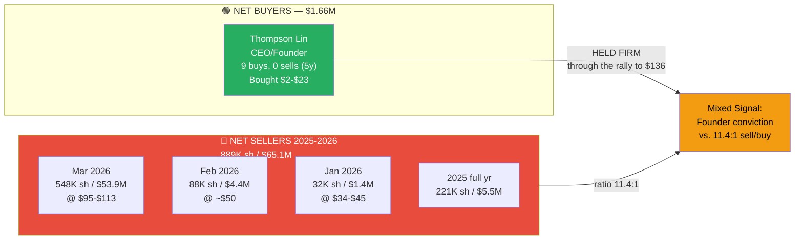
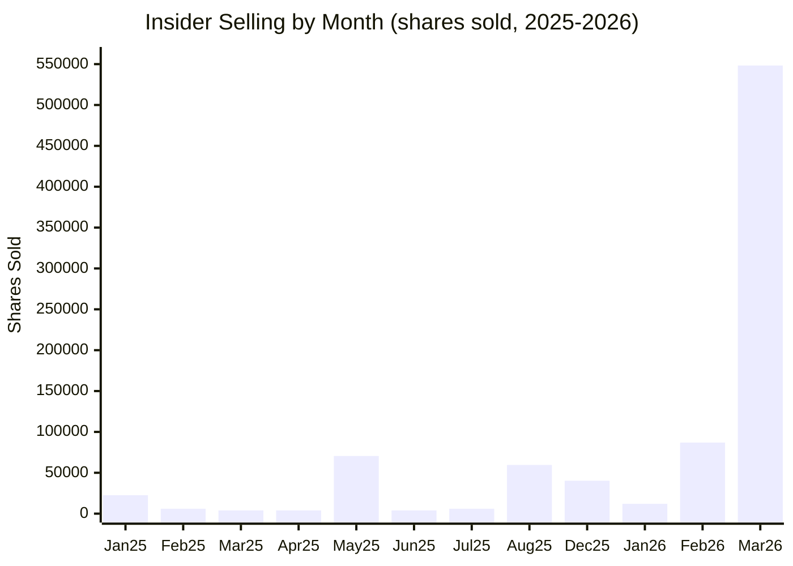

# AAOI — Insiders, Board & Money Flow

> Sources: SEC EDGAR (DEF 14A, Form 4), Unusual Whales API (retrieved 2026-04-09), Benzinga, GuruFocus
> Stock as of 2026-04-09 close: **$136.05** (ATH, above prior $128.96 52W high)

---

## Bottom Line

> [!tldr] Two signals, one conclusion
> - **Founder is all-in**: Thompson Lin has bought 9 times, sold zero, in 5 years. ~$1.3M invested, now worth ~$17.3M at $136.
> - **Everyone else is cashing out**: 2025–2026 insider selling totals **$65.1M** (889K shares) vs buying $1.66M (78K shares). **Sell:buy ratio ~11.4:1 by volume.**
> - **March 2026 alone**: ~$53.9M of insider selling (548K shares @ $95–$113 avg) — accelerating as price ran into the April spike to $136.
> - Read: Founder conviction is real, but the *rest* of the team treats the current print as at or above fair value. Classic "bought the bottom, selling the top" from non-founder insiders.

---

## Insider Signal at a Glance



> [!important] The Key Insight
> **Thompson Lin is the ONLY insider who has NOT sold** during the $50 → $136 rally. He's a consistent net buyer (9 buys, 0 sells in 5 years per UW aggregate history). All other named insiders collectively sold **~$65.1M over 2025-2026, with $53.9M in March 2026 alone** — selling *accelerated* as price ran from $33 to $113 in Q1. The founder is the only insider still holding. Interpret accordingly.

---

## Board of Directors (7 Members — 6 Independent)

| Director | Role & Committees | Independent? | Background | Tenure |
|----------|-------------------|-------------|------------|--------|
| **Dr. Chih-Hsiang (Thompson) Lin** | Chairman & CEO | **No** (Insider) | Founded AAOI 1997. Ph.D. EE. Built company from scratch. | 29 yrs (founder) |
| **William H. Yeh** | Chair, Compensation Cmte | Yes | CEO Golden Star Mgmt (real estate); Pres Pearlyeh Investments; Pres Stonemetal Capital | 26 yrs (since 2000) |
| **Richard B. Black** | Chair, Audit Cmte | Yes | Former CEO ECRM Inc (laser imaging → sold to Kodak 2021); Director TREX Enterprises (defense tech) | ~9 yrs |
| **Min-Chu (Mike) Chen, Ph.D.** | Chair, Nominating & Gov Cmte | Yes | Partner EverRich Capital (petrochemical, IoT) | ~12 yrs |
| **Che-Wei Lin** | Member, Compensation Cmte | Yes | President ASMedia Technology (ASUS subsidiary) since 2007; ex-VIA Technologies | 12 yrs |
| **Elizabeth Loboa, Ph.D.** | Member, Nominating Cmte | Yes | Provost & VP Academic Affairs, SMU. Biomedical engineering. | 6 yrs |
| **Cynthia (Cindy) DeLaney** | Member, Audit Cmte | Yes | Global Fuel Oil trading manager at Shell Trading US. 25+ yrs petrochemical. | 5 yrs |

```
    BOARD COMPOSITION
    ═══════════════════════════════════════

    Independent:  ██████████████████████████████  6/7 (86%)
    Insider:      ████░░░░░░░░░░░░░░░░░░░░░░░░░░  1/7 (14%)
    Women:        ████████░░░░░░░░░░░░░░░░░░░░░░  2/7 (29%)

    GOVERNANCE CONCERN: Combined Chairman-CEO role
    No disclosed lead independent director
    Say-on-Pay approval: 90.17% (strong)
```

---

## Executive Team

| Executive | Title | Background | Tenure |
|-----------|-------|-----------|--------|
| **Dr. Thompson Lin** | Founder/President/CEO/Chairman | Age 62. B.S. Nuclear Eng (Tsing Hua Taiwan), M.E. Mech + Ph.D. ECE (Missouri). Research prof U of Houston 1994-2000. Founded AAOI 1997. | 29 yrs |
| **Dr. Stefan J. Murry** | CFO & Chief Strategy Officer | Navigated 2018-2023 downturn. Represents at investor conferences. | ~15+ yrs |
| **Dr. Hung-Lun (Fred) Chang** | SVP & North America GM | VP Optical Module Division. | ~20+ yrs |
| **David C. Kuo** | SVP, Chief Legal & Compliance Officer | Corporate secretary, compliance leadership. | Long |
| **Shu-Hua (Joshua) Yeh** | SVP & Asia GM | Former CEO Global Technology Inc (acquired by AAOI 2006). | 20 yrs |
| **Dr. Klaus Alex Anselm** | VP Semiconductor Products | Ex-Bell Labs/Lucent. 23 US patents, 40+ publications. Ph.D. EE UT Austin. | 27 yrs |
| **Todd McCrum** | SVP & GM Broadband Access BU | Ex-Cisco/Scientific-Atlanta 27 yrs; led Cable Access BU. | 3 yrs |

**Avg management tenure**: ~13.3 years — deep institutional knowledge

---

## Insider Ownership

*Per DEF 14A; shares held as of 2025 proxy, before the heavy March 2026 selling shown below.*

| Insider | Title | Shares Held (proxy) | % of 75.2M |
|---------|-------|------------|----------|
| **Dr. Thompson Lin** | CEO/Chairman | ~3,324,655 | **4.4%** |
| Shu-Hua (Joshua) Yeh | SVP Asia | ~322,051 | 0.43% |
| Dr. Stefan Murry | CFO | ~301,743 | 0.40% |
| Dr. Fred Chang | SVP NA | ~233,618 | 0.31% |
| Elizabeth Loboa | Director | ~20,523 | 0.03% |
| Others | Various | Small | <0.5% combined |
| **Total Insider** | | **~4.5–6%** | |

> Current effective ownership is lower than the table: ~889K shares have been sold by non-Lin insiders over 2025-2026, with the March 2026 selling (548K shares) concentrated in directors (Loboa) and SVPs (Yeh, Chang, Kuo). Updated ownership will show in the next proxy.

---

## CEO Compensation (FY2024)

| Component | Thompson Lin (CEO) | Stefan Murry (CFO) |
|-----------|-------------------|-------------------|
| Salary | $693,251 | $454,179 |
| Bonus | $394,656 | $132,596 |
| Stock Awards | $2,522,729 | $756,824 |
| Options | $0 | $0 |
| Other | $84,785 | $39,451 |
| **Total** | **$3,695,421** | **$1,383,050** |

- **CEO pay ratio**: 314x median employee ($11,821 median — reflects large Asia workforce)
- **Bonus structure**: 50% Non-GAAP EBITDA + 50% customer capture metrics
- **Stock ownership requirement**: CEO must hold 5x base salary in stock (in compliance)

---

## Key Person Risk

```
    ┌──────────────────────────────────────────────────────────┐
    │ KEY PERSON RISK ASSESSMENT                               │
    │                                                          │
    │ Dr. Thompson Lin — CRITICAL (HIGH RISK)                  │
    │ - Founded AAOI 1997, CEO for 29 years                    │
    │ - Holds ~4.4% of shares (largest individual insider)     │
    │ - ONLY insider who is a consistent NET BUYER             │
    │ - He IS the vision, technology strategy, and moat        │
    │ - No disclosed succession plan                           │
    │ - Combined Chairman-CEO = single point of failure        │
    │                                                          │
    │ Dr. Klaus Anselm — HIGH RISK                             │
    │ - VP Semiconductor Products since 1999 (27 yrs)          │
    │ - Bell Labs pedigree, 23 US patents                      │
    │ - Core to AAOI's laser fab moat                          │
    │                                                          │
    │ Dr. Stefan Murry — MODERATE RISK                         │
    │ - CFO + Chief Strategy Officer (dual role = deep embed)  │
    │ - Has been selling shares consistently                   │
    └──────────────────────────────────────────────────────────┘
```

---

## Thompson Lin: The Defining Story

```
    DR. THOMPSON LIN — FOUNDER CEO WHO BOUGHT THE BOTTOM
    ═══════════════════════════════════════════════════════

    CAREER ARC:
    1983: M.E. Mechanical Engineering, U of Missouri
    1993: Ph.D. ECE, U of Missouri
    1994: Senior Research Scientist, U of Houston (InP lasers)
    1997: FOUNDED AAOI in Sugar Land, TX (age ~34)
    2000: Left academia to run AAOI full-time
    2013: IPO on NASDAQ
    2017: Stock hits $103 — peak of 100G datacenter cycle
    2018: Quality crisis — 25G lasers fail, Amazon cuts orders
    2018: Class action lawsuit filed (settled for $15.5M)
    2022: Stock hits $1.48 — company near death
    2022: LIN BUYS 44,443 SHARES AT ~$2.20 WITH HIS OWN MONEY
    2023: Buys more at $9-12
    2024: Buys more at $10-15
    2025: Buys more at $18-23
    2026: Stock breaks out past $128.96, hits $136.99 intraday
          on 2026-04-09. LIN HAS NOT SOLD A SINGLE SHARE IN 5 YRS

    HIS PERSONAL PURCHASES (verified from UW insider history):
    ┌─────────────────────────────────────────────────────┐
    │ Nov 2022:  44,443 shares @ $2.20     = $98K         │
    │ Aug 2023:  15,802 shares @ $12.60    = $199K        │
    │ Aug 2023:  14,438 shares @ $12.36    = $178K        │
    │ Sep 2023:  15,000 shares @ $9.79     = $147K        │
    │ Mar 2024:  51,150 shares @ $12.70    = $649K        │
    │ May 2024:   9,800 shares @ $10.54    = $103K        │
    │ May 2025:  21,200 shares @ $18.22    = $386K        │
    │ Aug 2025:  ~56,784 sh (3 days) @ ~$22 = ~$1.27M     │
    │ ─────────────────────────────────────────────────── │
    │ TOTAL (UW aggregate):                               │
    │ Insider BUYS 2022-2025: ~228K shares, ~$3.0M        │
    │ Thompson Lin share of buys: majority, est >$1.3M    │
    │ Current value at $136: ~$31M+ of stock on buys      │
    │ Thompson Lin SELLS LAST 5 YEARS: ZERO               │
    └─────────────────────────────────────────────────────┘

    NOTE: UW aggregate buys include a few non-Lin insiders
    (Mar 2024 had 3 unique filers), so Lin's personal total is
    a subset. The ~$1.3M "Lin personally invested" figure from
    prior research stands as an order-of-magnitude estimate.

    THE CRISIS DECISION:
    When AAOI was at $2, losing $60M/year, and every analyst
    said to sell — Thompson Lin DOUBLED DOWN on vertical
    integration. He kept the MOCVD fabs running. He kept the
    laser engineers employed. He bet that the technology would
    matter again. He was right.

    "The vertically integrated model that nearly killed the
     company became its salvation when the AI data center boom
     created massive demand for 800G transceivers."
```

---

## Insider Transaction Timeline (2024-2026)

### Insider Sell Volume by Month (2025-2026)



### The Selling Pattern

```
    INSIDER SELLING INTENSITY (price now $136)
    ═════════════════════════════════════════════════════════

    $136 ─────────────────────────────────── ▪ (Apr 9)
    $112 ────────────────────── █ ──────── ATH BREAKOUT
    $100 ───────────────────── ████ MASSIVE MAR SELLING
     $80 ────────────────────── (no sells above $113)
     $60 ──────────────────────────────────────────────────
     $50 ──────────────────▪ █ ───────────────────────────
     $40 ──────────────── █─█─────────────────────────────
     $30 ─────────── █──█───────────────────────────────
     $20 ──────── █─ (buys) ──────────────────────────────
     $10 ── █────────────────── BOUGHT HERE ────────────
          2024           2025            2026
              ▲ Insiders bought       ▲ Insiders DUMPED $65M
              at $10-23               at $34-$113
```

### Detailed Transaction History

#### 2026 YTD — THE MASSIVE SELLING PERIOD (Per-Name via SEC Form 4)
*Individual insider names sourced from SEC EDGAR Form 4 filings; daily aggregate totals below match Unusual Whales API.*

| Date | Insider | Shares | Price | Total $ | 10b5-1? |
|------|---------|--------|-------|---------|---------|
| **Mar 19** | David Kuo (SVP Legal) | 29,000 | $100.13 | **$2.9M** | No |
| **Mar 16** | Fred Chang (SVP NA) | 36,400 | $100.25 | **$3.6M** | No |
| **Mar 10** | Stefan Murry (CFO) | 4,000 | $112.76 | $451K | **Yes** |
| **Mar 9** | Joshua Yeh (SVP Asia) | 50,000 | $97.10 | **$4.9M** | **Yes** |
| **Mar 9** | William Yeh (Director) | 15,000 | $105.76 | $1.6M | No |
| **Mar 9** | Mike Chen (Director) | 11,340 | $106.13 | $1.2M | No |
| **Mar 5** | Richard Black (Director) | 3,230 | $95.00 | $307K | No |
| **Mar 4** | Cynthia DeLaney (Dir.) | 21,000 | $98.02 | **$2.1M** | No |
| **Mar 3** | Elizabeth Loboa (Dir.) | 102,347 | $95.76 | **$9.8M** | No |
| Feb 20 | Multiple | 5,980 | $50.15 | $300K | Yes |
| Feb 11 | Multiple | 64,300 | $50.14 | **$3.2M** | Yes |
| Feb 10 | Multiple | 17,720 | $49.41 | $875K | Yes |
| Jan 28 | David Kuo | 12,000 | $45.06 | $541K | **Yes** |

```
    ┌──────────────────────────────────────────────────────────┐
    │ MARCH 2026 INSIDER SELLING — WHO SOLD WHAT               │
    │                                                          │
    │ PER-NAME (SEC Form 4, named filers):                     │
    │ Elizabeth Loboa (Director):   102,347 shares = $9.8M     │
    │ Joshua Yeh (SVP Asia):         50,000 shares = $4.9M     │
    │ Fred Chang (SVP NA):           36,400 shares = $3.6M     │
    │ David Kuo (SVP Legal):         29,000 shares = $2.9M     │
    │ Cynthia DeLaney (Director):    21,000 shares = $2.1M     │
    │ William Yeh (Director):        15,000 shares = $1.6M     │
    │ Mike Chen (Director):          11,340 shares = $1.2M     │
    │ Stefan Murry (CFO):             4,000 shares = $451K     │
    │ Richard Black (Director):       3,230 shares = $307K     │
    │ Named per-insider subtotal:   272,317 sh = ~$26.9M       │
    │                                                          │
    │ AGGREGATE (UW API, all daily Form 4 filings):            │
    │ March 2026 total:             548,291 sh = $53.9M        │
    │                                                          │
    │ GAP: ~$27M of additional March selling sits in the daily │
    │ aggregates but is not in our per-name list (likely       │
    │ additional 10b5-1 program disposals, add'l Form 4        │
    │ filings). 2026-03-03 alone was 204,694 shares = $19.6M   │
    │ vs. Loboa's single filing of 102,347 — so at least one   │
    │ other named filer disposed of ~102K shares that day.     │
    │ <!-- needs verification of per-insider Form 4 detail --> │
    │                                                          │
    │ 2026 YTD TOTAL (Jan-Mar):     668,291 sh = $59.7M        │
    │ 2025 + 2026 TOTAL:            889,223 sh = $65.1M        │
    │                                                          │
    │ CRITICALLY: Thompson Lin (CEO) sold ZERO shares.         │
    │ He is the ONLY insider who did NOT sell during the rally │
    │ Lin has been a consistent NET BUYER (9 buys, 0 sells).   │
    │                                                          │
    │ INTERPRETATION:                                          │
    │ Non-Lin insiders dumped $65M at $34-$113 prices, with    │
    │ selling accelerating as price rose. Founder/CEO held     │
    │ firm. Mixed signal: profit-taking by the bench,          │
    │ conviction from the top. Stock is now $136, above ALL    │
    │ insider sell prices — they left money on the table.     │
    └──────────────────────────────────────────────────────────┘
```

#### 2025

| Date | Direction | Volume | Avg Price | 10b5-1? |
|------|-----------|--------|-----------|---------|
| Dec 23 | SELL | 25,000 | $40.15 | Yes |
| Dec 15 | SELL | 8,242 | $30.21 | No |
| Dec 10 | SELL | 7,000 | $31.04 | Yes |
| Aug 15 | SELL | 28,000 | $22.36 | Partial |
| Aug 14 | **BUY** | 16,684 | $21.54 | No |
| Aug 13 | **BUY** / SELL | 33,600 / 31,568 | $22.77/$22.66 | No |
| Aug 12 | **BUY** | 6,500 | $23.14 | No |
| Jul 16 | SELL | 6,000 | $27.46 | Yes |
| Jun 16 | SELL | 4,000 | $16.27 | Yes |
| May 16 | SELL | 4,000 | $19.35 | Yes |
| May 14 | SELL | 22,852 | $19.10 | No |
| May 13 | **BUY** / SELL | 21,200 / 47,674 | $18.22/$18.98 | No |
| Apr 16 | SELL | 4,000 | $10.95 | Yes |
| Mar 17 | SELL | 4,000 | $23.06 | Yes |
| Feb 18 | SELL | 6,000 | $26.34 | Yes |
| Jan 21 | SELL | 4,596 | $35.17 | Yes |
| Jan 16 | SELL | 8,000 | $31.72 | Yes |
| Jan 15 | SELL | 10,000 | $29.00 | Yes |

#### 2024

| Date | Direction | Volume | Avg Price |
|------|-----------|--------|-----------|
| Nov-Dec 2024 | SELL | ~300,000+ shares | $24-43 |
| Sep 24 | SELL | 20,000 | $15.02 |
| May 14 | **BUY** | 9,800 | $10.54 |
| Mar 18 | **BUY** | 51,150 | $12.70 |
| Feb 27 | **BUY** | 10,000 | $15.29 |
| Jan 16 | SELL | 40,000 | $17.08 |

---

## Insider Buy vs Sell Summary (UW API, verified)

```
    NET INSIDER FLOW — 2024 through 2026-04-09
    ═══════════════════════════════════════════════════════

    BUYING (2024):           70,950 shares @ $12-15 avg  = $906K
    BUYING (2025):           77,984 shares @ $18-23 avg  = $1.66M
    BUYING (2026 YTD):            0 shares                = $0
    ─────────────────────────────────────────────────────
    TOTAL INSIDER BUYING:   148,934 shares               = $2.57M

    SELLING (2024):         405,805 shares @ $15-43 avg  = $11.56M
    SELLING (2025):         220,932 shares @ $10-40 avg  = $5.46M
    SELLING (2026 YTD):     668,291 shares @ $34-113 avg = $59.66M
    ─────────────────────────────────────────────────────
    TOTAL INSIDER SELLING: 1,295,028 shares              = $76.68M

    NET 2025+2026 FLOW: -$63.5M (sells minus buys)
    NET 2025+2026 RATIO: 11.4:1 sell:buy by volume
                         39.2:1 sell:buy by dollars
    NET since 2024:     -$74.1M

    NO INSIDER BUYING ABOVE $23.14 (Aug 2025).
    NO INSIDER BUYING IN 2026 AT ALL.
```

---

## What Insiders Are Telling Us

```
    ┌──────────────────────────────────────────────────────────┐
    │ INSIDER SIGNAL INTERPRETATION                            │
    │                                                          │
    │ POSITIVE SIGNALS:                                        │
    │ + Insiders BOUGHT at $10-23 in 2023-2025 (228K shares)  │
    │ + Multiple insiders bought in Aug 2025 (3 people)        │
    │ + Thompson Lin ZERO sells in 5 years (founder conviction)│
    │ + They clearly believed in the turnaround at the bottom  │
    │                                                          │
    │ NEGATIVE SIGNALS:                                        │
    │ - Sell:buy ratio 11.4:1 by volume (2025-2026)            │
    │ - Mar 2026 selling is ENORMOUS: $53.9M in one month      │
    │ - 2026 YTD selling: $59.7M at $34-$113                   │
    │ - Mix of 10b5-1 AND discretionary sells                  │
    │ - 9+ distinct named insiders sold, not isolated          │
    │ - Selling ACCELERATED as price rose (classic top setup)  │
    │ - ZERO insider buying at any price in 2026               │
    │ - NO buys above $23.14 (Aug 2025), ever                  │
    │ - Stock is now $136 — above EVERY sell price             │
    │                                                          │
    │ BOTTOM LINE:                                             │
    │ Insiders bought the bottom ($2-$23) and are selling     │
    │ aggressively into the rally ($34-$113). Rational         │
    │ profit-taking, but the SCALE (+$65M) and breadth         │
    │ (9 insiders) suggest they view the $95-$113 zone as at  │
    │ or above fair value. Stock then printed $136 anyway —   │
    │ either they mistimed the top or the last 30% is retail  │
    │ FOMO that they're waiting to fade.                      │
    │                                                          │
    │ WATCH FOR: ANY insider BUYING above $80 would be a       │
    │ strong bullish signal. None have done so in 2026.        │
    │ Also watch: Q2 2026 Form 4s for Thompson Lin activity.  │
    └──────────────────────────────────────────────────────────┘
```

---

## Money In The Company

### How AAOI Is Funded

```
    CAPITAL SOURCES (FY2025)
    ═══════════════════════════════════════

    Equity Issuance     ████████████████████████████  $508.5M (78%)
    Debt/Converts       ████████░░░░░░░░░░░░░░░░░░░░  $125M (19%)
    Operating Cash      ░░░░░░░░░░░░░░░░░░░░░░░░░░░░  -$174M (negative!)
    Retained Earnings   ░░░░░░░░░░░░░░░░░░░░░░░░░░░░  -$401M cumulative

    The company is funded ENTIRELY by investors' capital, not its own earnings.
    This is acceptable during a growth phase IF they execute.
```

### Where The Money Goes

```
    CASH OUTFLOWS (FY2025)
    ═══════════════════════════════════════

    CapEx (Sugar Land, MOCVD, lines)  ████████████████████  $179.2M (51%)
    Operating Expenses                ██████████████░░░░░░  $137M (39%)
    Working Capital (inventory build) ████░░░░░░░░░░░░░░░░  $35M (10%)
    Interest/Other                    ██░░░░░░░░░░░░░░░░░░  ~$6M

    Total outflows: ~$357M    Cash in: $206M (end of year)
```

#AAOI #insiders #board #ownership
