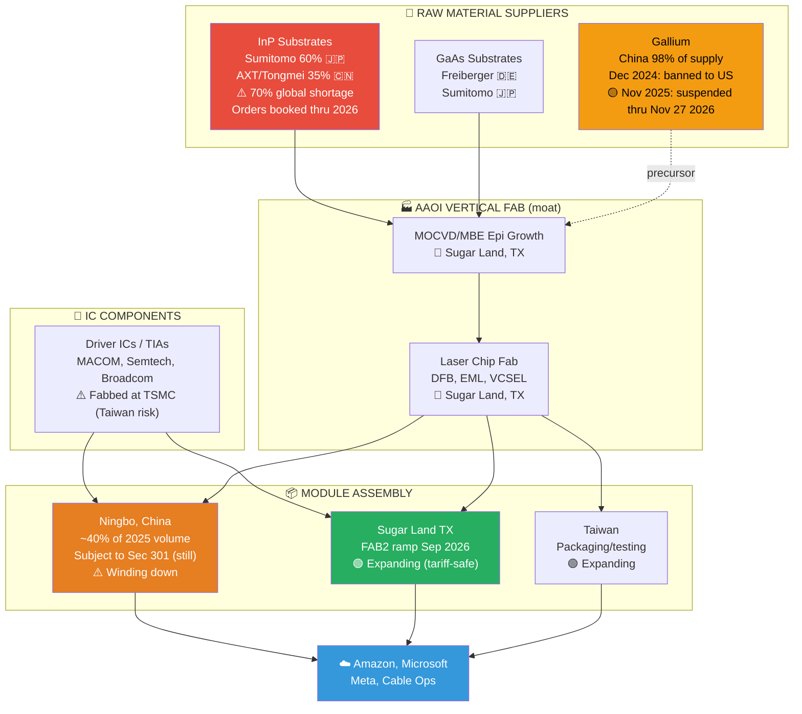
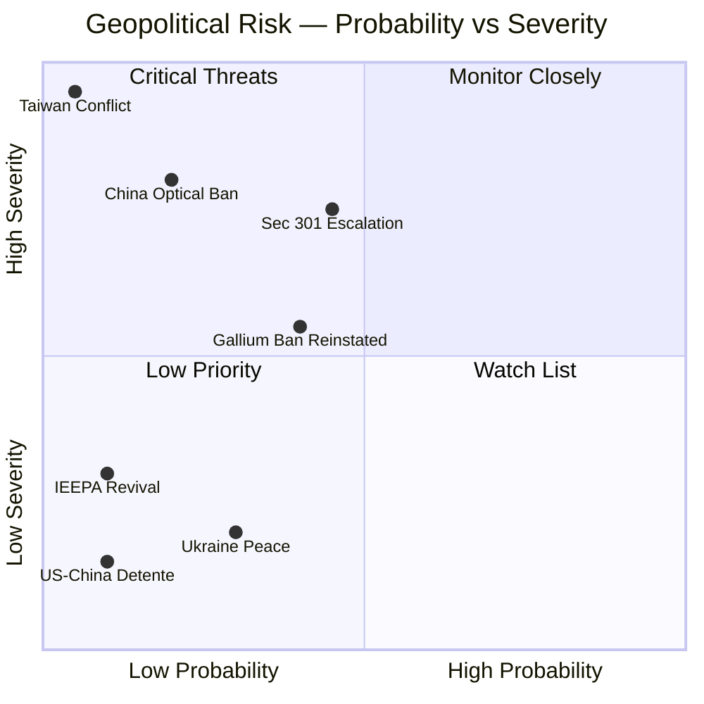

# AAOI — Supply Chain & Geopolitical Risk

> Last reviewed: 2026-04-09 (stock $136.05). Tariff & gallium sections updated to reflect SCOTUS IEEPA ruling (Feb 2026) and China export-ban suspension (Nov 2025).

---

## Bottom Line

> [!tldr] Paradoxical tailwinds
> - **Raw materials**: InP substrates are the real bottleneck — 70% global shortage, demand (2M pcs) vs capacity (600K pcs). Sumitomo 60% / AXT-Tongmei 35%. Gallium China export ban was **suspended Nov 2025** and runs until **Nov 27, 2026** — price pressure is easing from peak.
> - **China exposure**: Ningbo assembly was ~60–70% in 2023, on track to <10% by 2027. CFO: "less than 10% China component value in 800G/1.6T" today, path to near-zero.
> - **Tariffs**: SCOTUS (Feb 20, 2026, 6-3) struck down **IEEPA-based** tariffs only. **Section 301 China tariffs (25% baseline, up to 100% on some products) remain in effect**, and Trump admin launched new Section 301 investigations March 11, 2026. AAOI Ningbo exposure is still tariffed; Sugar Land pivot is still the right call.
> - **Defense**: No revenue today, but Project Vault ($11.67B critical minerals reserve, Feb 2026) + ElementUSA ($29.9M Pentagon gallium award, Nov 2025) + DoD 2027 China ban = optionality tailwind.
> - **Net**: AAOI is paradoxically a **beneficiary** of trade war escalation via its US manufacturing pivot. The old bear thesis (China kills margins) is being neutralized as Sugar Land ramps.

---

## Supply Chain Map



---

## China Exposure — De-Risking In Progress

```
    CHINA MANUFACTURING EXPOSURE TIMELINE
    ══════════════════════════════════════

    2023:  ████████████████████████████████  ~70% China assembly
    2024:  ██████████████████████████░░░░░░  ~60% (beginning shift)
    2025:  ████████████████░░░░░░░░░░░░░░░░  ~40% (active transition)
    2026E: ████████░░░░░░░░░░░░░░░░░░░░░░░░  ~20% (Sugar Land ramp)
    2027E: ██░░░░░░░░░░░░░░░░░░░░░░░░░░░░░░  <10% (target)

    CFO Stefan Murry:
    "Less than 10% of component value in 800G/1.6T designs
     is China-sourced, with a path to near-zero."

    "The one place where I am pretty confident in saying it
     is not going to be tariffed is product made in the U.S."
```

### Tariff Impact (Quantified)

| Metric | Value |
|--------|-------|
| Section 301 tariff rate (China) | 25% baseline, up to 100% on certain products — **STILL IN EFFECT** |
| Section 232 (steel/aluminum) | Still in effect |
| IEEPA "reciprocal" + fentanyl tariffs | **Struck down by SCOTUS 2026-02-20 (6-3)** in *Learning Resources v. Trump* (24-1287) — terminated by proclamation March 2026 |
| Trump admin response | Launched **new Section 301 investigations** 2026-03-11 vs China/Mexico/EU to rebuild trade war via Sec 301 authority (slower but legally durable) |
| FY2025 direct tariff cost | ~$7–8M (~$1.2M P&L + ~$3.1M on equipment) |
| Net result for AAOI | **Ningbo is still tariffed** (Sec 301 China stayed in effect). Sugar Land pivot remains the right strategic bet. Only "relief" was on the global reciprocal tariffs AAOI was never directly exposed to anyway. |

---

## Competitor Supply Chain Comparison

```
    CHINA MANUFACTURING EXPOSURE BY COMPANY
    ════════════════════════════════════════

    AAOI            ████████████████░░░░  60-70% → rapidly declining
    InnoLight       ████████████████████  100% (Chinese company)
    Coherent        ████████░░░░░░░░░░░░  Moderate (Malaysia/Thailand)
    Lumentum        ████░░░░░░░░░░░░░░░░  Low (Thailand/Japan primary)
    Cisco/Acacia    ██░░░░░░░░░░░░░░░░░░  Low (US/Thailand)
    Fabrinet        ░░░░░░░░░░░░░░░░░░░░  Zero (Thailand/Israel)

    TARIFF VULNERABILITY (if tariffs return):
    Most exposed ──────────────────────── Least exposed
    InnoLight > AAOI(old) > Coherent > Lumentum > Fabrinet
                  AAOI(new) ─────────────────────→ Low exposure by 2027
```

---

## War & Conflict Impact Matrix

### US-China Trade War (HIGHEST IMPACT)

```
    ┌─────────────────────────────────────────────────────────┐
    │ SCENARIO ANALYSIS (post-SCOTUS, post-gallium suspension)│
    ├─────────────────────────────────────────────────────────┤
    │                                                         │
    │ CURRENT STATE (2026-04-09):                             │
    │ • Sec 301 China tariffs still in force (25% baseline)   │
    │ • New Sec 301 investigations launched Mar 11, 2026      │
    │ • IEEPA-based tariffs terminated post-SCOTUS ruling     │
    │ • AAOI Ningbo is STILL tariffed                         │
    │ • Gallium ban SUSPENDED Nov 2025 thru Nov 27 2026       │
    │                                                         │
    │ IF Sec 301 tariffs raised (new investigation outcome):  │
    │ → AAOI MITIGATED: Sugar Land pivot absorbs impact       │
    │ → Short-term pain ($5-10M cost), long-term neutral      │
    │ → Stock impact: -5% to -10% knee-jerk, then recovery    │
    │                                                         │
    │ IF US bans ALL Chinese optical components (DoD 2027):   │
    │ → AAOI WINS BIG: US-manufactured = competitive edge     │
    │ → InnoLight locked out of US market                     │
    │ → Sugar Land becomes strategic national asset           │
    │                                                         │
    │ IF China REINSTATES gallium/germanium ban after         │
    │ Nov 27, 2026 (high probability given current tensions): │
    │ → AAOI HURT: Input costs rise for laser substrates      │
    │ → BUT: Vertical integration = relative advantage        │
    │ → All laser makers equally affected                     │
    │ → Project Vault stockpile provides partial buffer       │
    │                                                         │
    │ IF IEEPA tariffs are revived via Congress or statute:   │
    │ → Low probability near-term (requires legislative act)  │
    │ → AAOI MITIGATED by Sugar Land                          │
    └─────────────────────────────────────────────────────────┘
```

### Gallium/Germanium Crisis (QUANTIFIED)

```
    CRITICAL MATERIAL STATUS (Apr 2026)
    ═══════════════════════════════════════

    GALLIUM:   $2,269/kg  <!-- needs verification of current spot -->
               (peaked ~+845% from pre-control $240/kg)
               China controls 98% of global supply
               Dec 2024: China BANNED gallium exports to US
               Nov 9, 2025: China SUSPENDED the ban thru
                            Nov 27, 2026 (trade detente)
               → Near-term price relief, but the kill switch
                 is still in Beijing's hands

    GERMANIUM: $8,598/kg  <!-- needs verification of current spot -->
               (peaked ~+760% from early 2023 $1,000/kg)
               Wrought exports from China fell 60%
               Also subject to the Nov 2025 ban suspension

    InP SUBSTRATES: 70% GLOBAL SUPPLY-DEMAND GAP
               Demand: ~2M pieces in 2025
               Capacity: ~600,000 pieces
               Orders fully booked through 2026
               (THIS is AAOI's real bottleneck, not gallium)

    KEY SUPPLIERS:
    Sumitomo Electric:  ~60% market share (Japan)
    AXT/Tongmei:        ~35% market share (Beijing)
      → Tongmei blocked from exporting InP (Feb 2025)
      → Received partial export permits Aug 2025
      → AXT raised $187M to double capacity

    US RESPONSE (2025-2026):
    - ElementUSA: $29.9M DoW* award (Nov 2025)
      for domestic gallium + scandium from bauxite residue
      (*Department of War — DoD renamed 2025)
    - DOE: $6M for gallium R&D
    - DARPA: Raytheon contract for diamond semiconductors
      (gallium-free alternative)
    - Project Vault (Feb 2026):
      $10B EXIM Bank loan + ~$1.67B private = $11.67B total
      US Strategic Critical Minerals Reserve
      Trading partners: Hartree, Traxys, Mercuria
      Stockpiles 60 critical minerals
```

### Taiwan Risk (EXISTENTIAL)

```
    ┌─────────────────────────────────────────────────────────┐
    │ TAIWAN CONFLICT = INDUSTRY-WIDE CATASTROPHE             │
    │                                                         │
    │ Impact on AAOI:                                         │
    │ - TSMC-fabbed driver ICs disrupted (ALL competitors)    │
    │ - AAOI Taiwan operations frozen                         │
    │ - If US-China escalates: Ningbo also at risk            │
    │ - Sugar Land would be only operational facility          │
    │                                                         │
    │ Probability: ~5%           Stock impact: -80 to -95%    │
    │                                                         │
    │ NOTE: This risk is NOT unique to AAOI — the entire      │
    │ semiconductor industry would collapse                   │
    └─────────────────────────────────────────────────────────┘
```

### Other Conflicts

| Conflict | AAOI Impact | Mechanism |
|----------|-------------|-----------|
| Ukraine-Russia | Negligible direct | Fiber demand for military drones; European data center acceleration |
| Middle East / Red Sea | Negligible direct | Subsea cable disruptions; energy cost volatility |
| Russia fiber plant destroyed | Indirect positive | Russia consuming 10.5% of global fiber output from China, raising prices |

---

## Defense Exposure

```
    ┌─────────────────────────────────────────────────────────┐
    │ AAOI HAS NO DEFENSE REVENUE                             │
    │                                                         │
    │ - No ITAR clearance                                     │
    │ - No mil-spec products                                  │
    │ - No government contracts disclosed                     │
    │ - No CHIPS Act grants announced                         │
    │                                                         │
    │ Defense fiber optic suppliers:                           │
    │ KITCO Fiber Optics, L3Harris, Amphenol, Smiths, Teledyne│
    │                                                         │
    │ POTENTIAL UPSIDE:                                        │
    │ - DoD 2027 mandate bans Chinese parts → opens door      │
    │ - Sugar Land facility could pursue mil-spec certs        │
    │ - InP laser tech has dual-use applications (LIDAR, FSO) │
    │ - Pentagon replacing 50-year-old copper networks         │
    │   with fiber ($15.1B FY2026 cyber budget)               │
    └─────────────────────────────────────────────────────────┘
```

---

## Key Risk Matrix



| Risk | Severity | Probability | Direction for AAOI |
|------|----------|------------|-------------------|
| New Section 301 tariff escalation (post-Mar 11 investigation) | HIGH | 45% | **NET POSITIVE** (Sugar Land advantage) |
| Full China optical component ban (DoD 2027 mandate) | HIGH | 20% | **STRONGLY POSITIVE** |
| Gallium/germanium ban reinstated after Nov 27, 2026 | MODERATE | 40% | NEGATIVE (margins), relative advantage holds |
| Taiwan conflict | EXISTENTIAL | 5% | CATASTROPHIC (but industry-wide) |
| IEEPA tariff revival via Congress | LOW | 10% | NEGATIVE short-term, mitigated by Sugar Land |
| Ukraine peace / stabilization | LOW | 30% | Mildly positive |
| US-China detente | LOW | 10% | Positive optionality; would ease InP/gallium |

**Bottom line**: AAOI has paradoxically become a **beneficiary** of trade war escalation due to its aggressive US manufacturing pivot. The SCOTUS ruling did NOT remove Section 301 China tariffs — it only ended IEEPA-based tariffs, and the Trump admin has already launched new Section 301 investigations to rebuild the trade war on more durable legal footing. The old bear thesis (China exposure kills margins) is being neutralized as Sugar Land ramps — and the ramp should complete *before* any new 301 tariffs take effect.

#AAOI #geopolitics #supplychain #tariffs #defense
