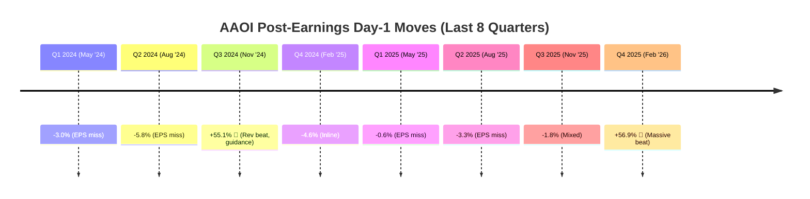
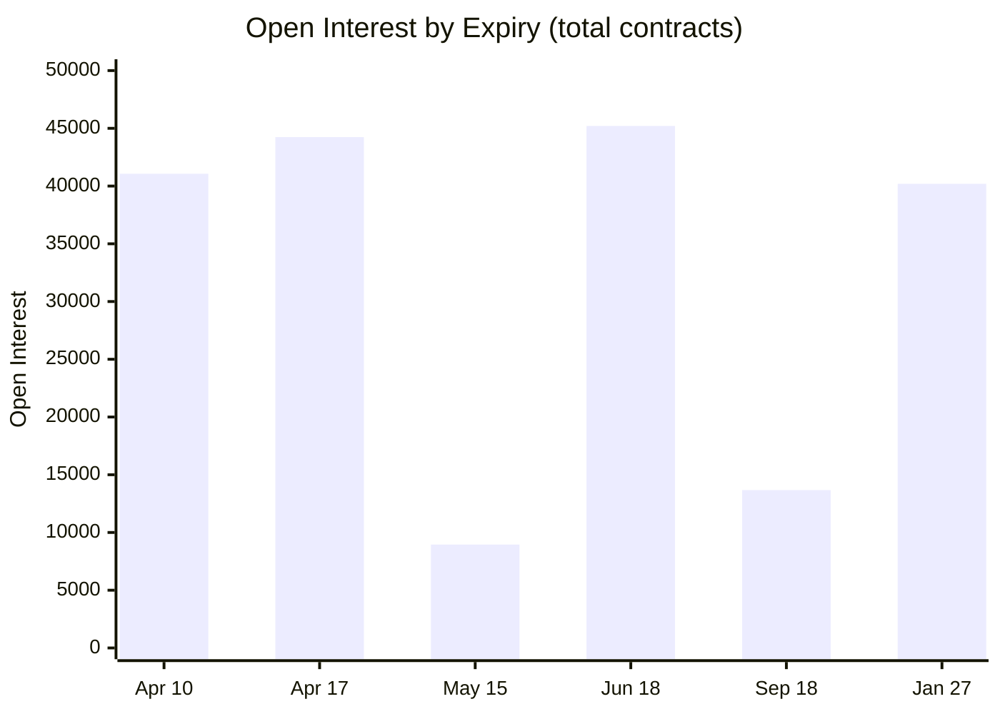

# AAOI — Options Flow & Market Intelligence

> Data as of April 9, 2026 (close $136.05, prev close $133.30)

---

> [!important] BOTTOM LINE
> 1. **IV at 1Y max**: 159.8% IV, 97.8% IV Rank (1Y) — options are as expensive as they have been all year.
> 2. **Flow is neutral, not bullish**: Net call premium -$107K and net put premium +$617K on a +30% run — no fresh institutional chase on the rip.
> 3. **May earnings expected move ~32.9%**: First post-ER expiry (May 15) prices a ±$43.84 move around $136 spot.
> 4. **Max pain is structurally BELOW spot on every near-term expiry** ($90–$115 across Apr–May). Dealers are short calls; pinning pressure points DOWN.
> 5. **Dealers long +8.32M delta, +28.5K gamma** — reflexive, vol-dampening until the earnings vol crush breaks.

---

## Earnings Move History (Visual)



> [!tip] Pattern
> AAOI either barely moves (−1% to −6%) or EXPLODES (+55%). The explosions happen on Q3/Q4 reports (Nov/Feb). May earnings historically produce small moves — **iron condors have worked on May earnings**.

---

## IV & Volatility Profile

| Metric | Value | Signal |
|--------|-------|--------|
| IV (Current) | **159.8%** | Near 1Y high — extremely expensive |
| IV Rank (1Y) | **97.8%** | At top of 1Y range — options priced for chaos |
| IV Low / High (1Y) | 83.8% / 161.5% | Current sits ~98% of the way up |
| RV (Realized) | **170.7%** | RV > IV → IV still "cheap" vs actual |
| Beta | **3.95** | Moves ~4x the market |
| 52W High (new ATH) | **≥$136.99** intraday | Exceeded prior $128.96 on Apr 9 |

```
    IV RANK 1-YEAR TREND (to Apr 9, 2026)
    ════════════════════════════════════════════

    100% ──────────────────────────────▪ 97.8% ← NOW
                                       ▪
     80% ───────────────────────────▪──────
                                  ▪
     60% ────────────────────▪────────────
                          ▪
     50% ─ ─ ─ ─ ─ ─ ─ ─ ▪ ─ ─ ─ ─ ─ ─ ─ ─
                     ▪
     40% ─────────▪────────────────────────
              ▪
     20% ─▪────────────────────────────────
        May25                          Apr9'26

    IV Rank rocketed from 54.3% (Apr 2) → 97.8% (Apr 9)
    as the +30% rip rewrote the realized vol profile.
```

---

## Flow & Premium Snapshot (Apr 9, 2026)

| Metric | Value | 30d Avg | Signal |
|--------|-------|---------|--------|
| Call volume | 36,906 | 28,200 | **1.31x** normal |
| Put volume | 20,391 | 16,302 | 1.25x normal |
| Put/Call volume | 0.55 | — | Call-skewed |
| Call premium | **$64.5M** | — | Massive call $ |
| Put premium | $10.5M | — | Normal |
| **Net call premium** | **−$107K** | — | **Neutral — dealers selling into the rip** |
| Net put premium | +$617K | — | Mild put buying |
| Bullish premium | $22.27M | — | — |
| Bearish premium | $22.99M | — | **Bearish > Bullish by $724K** |
| Call OI | 119,185 | — | |
| Put OI | 103,810 | — | P/C OI 0.87 |

> [!warning] FLOW IS NOT CONFIRMING THE RIP
> AAOI is up +30% in 5 trading days, yet net call premium is **negative** and bearish premium is slightly larger than bullish. This is a stark divergence: retail chases, pros are fading/rolling up.

---

## Max Pain by Expiry (Spot $136)

| Expiry | Max Pain | Stock vs Pain | Implication |
|--------|----------|---------------|-------------|
| **Apr 10** (1d) | **$110** | **−$26** below | Heavy dealer short-call pressure; expiry pin lower |
| **Apr 17** (8d) | **$90** | **−$46** below | Enormous dislocation — OI walls way below |
| **Apr 24** (15d) | $110 | −$26 below | Stock priced ~24% above MP |
| **May 1** (22d) | $100 | −$36 below | |
| **May 8** (29d) | $100 | −$36 below | Pre-earnings week |
| **May 15** (post-ER) | $100 | −$36 below | First post-ER expiry |
| **May 22** (43d) | $115 | −$21 below | Closest MP to spot |
| Jun 18 | $35 | −$101 below | Stale LEAPS OI — disregard |
| Jul 17 | $90 | −$46 below | |
| Sep 18 | $70 | −$66 below | |
| Jan 2027 | $40 | −$96 below | Deep LEAPS hedging |

> [!danger] MAX PAIN IS UNIFORMLY BELOW SPOT
> **Every single near-term expiry's max pain sits $21–$46 below the $136 close.** Dealers are structurally short calls. If spot drifts, gamma pulls the tape DOWN toward the $100–$115 OI walls. The ONLY thing overriding this is a continued squeeze / earnings gap.

---

## Open Interest Structure (Apr 9, 2026)



### Key OI Concentrations

| Expiry | Volume | OI | Chains | Signal |
|--------|--------|----|-------|--------|
| **Apr 10** (tmr) | **25,575** | 41,067 | 238 | Gamma-heavy expiry Friday |
| **Apr 17** | **13,241** | **44,238** | 214 | Monthly — biggest near-term position |
| **Jun 18** | 2,253 | **45,202** | 156 | **Largest single OI — core longs** |
| **Jan 2027** | 5,679 | **40,196** | 96 | **LEAPS hedging concentration** |
| Sep 18 | 1,273 | 13,669 | 118 | Moderate |
| **May 15** (post-ER) | 2,969 | 8,956 | 50 | **Earnings expiry — watch OI build** |

```
    ┌──────────────────────────────────────────────────────────┐
    │ INTERPRETATION (Apr 9 2026):                             │
    │                                                          │
    │ TOTAL: 119K call OI vs 104K put OI (C/P ratio 1.15x)     │
    │ → Only MILDLY call-skewed in aggregate; the heavy        │
    │   bullish skew that existed on Apr 2 has normalized      │
    │   as shorts covered and puts were bought as hedges.      │
    │                                                          │
    │ Jun 18 (45K OI) is the biggest single expiry and still   │
    │ functions as the primary "core long" bucket.             │
    │                                                          │
    │ Jan 2027 (40K OI) remains the key LEAPS hedging locus    │
    │ — institutions running "long equity + long put" stacks.  │
    │                                                          │
    │ DEALER GREEK POSITIONING:                                │
    │ • Net delta: +8.32M (dealers very long — short calls)    │
    │ • Net gamma: +28,484 (positive → dampens intraday vol)   │
    │ • Net call vanna: +772K (rising vol → more dealer $buy)  │
    └──────────────────────────────────────────────────────────┘
```

---

## Short Volume Analysis

> [!note] Short-volume series below is from the Apr 2 snapshot and has not been refreshed. <!-- needs verification for Apr 3–9 -->

| Date | Short Vol | Total Vol | Short Ratio | Signal |
|------|-----------|-----------|-------------|--------|
| Apr 2 | 4.34M | 9.23M | **47.0%** | Elevated |
| Apr 1 | 2.25M | 6.04M | 37.3% | Normal |
| Mar 31 | 1.95M | 6.03M | 32.3% | Normal |
| Mar 30 | 2.75M | 6.16M | 44.7% | Elevated |
| Mar 27 | 1.19M | 3.17M | 37.7% | Normal |

```
    NORMAL RANGE: 25-37%     ELEVATED: >40%

    Apr 2 at 47% is SIGNIFICANTLY elevated
    → The +27% Apr 2 reversal triggered a squeeze that has
      carried through the week to the $136 close on Apr 9.
    → 1.7M shares available to short (Dec 2025 snapshot)
```

---

## Unusual Flow Alerts (Apr 9)

| Time (UTC) | Type | Strike / Expiry | Vol | Prem | Side | Rule |
|------------|------|-----------------|-----|------|------|------|
| 14:17 | CALL | $180 / Jun 18 | 202 | $91K | **ask** | RepeatedHits |
| 14:25 | PUT  | $136 / Apr 10 | 318 | $183K | **ask** | RepeatedHitsDesc |
| 14:26 | CALL | $135 / Sep 18 | 20 | $41K | bid | RepeatedHitsDesc |
| 14:37 | CALL | $160 / May 15 | 45 | $17K | ask | RepeatedHits |
| 15:31 | CALL | $135 / May 15 | 69 | $49K | bid | RepeatedHits |
| 17:07–17:55 | CALL | $160 / May 15 | 83–124 | ~$75K | ask | RepeatedHits |
| 17:32 | CALL | $120 / May 15 | 120 | $26K | bid | RepeatedHits |
| 19:27 | CALL | $160 / May 15 | 142 | $15K | ask | RepeatedHits |
| 19:37–19:58 | CALL | **$150 / Apr 17** | 1,762→3,351 | ~$124K each | mixed | **Sweep + RepeatedHits** |

> [!tip] FLOW THEMES
> - **May 15 (post-ER) $160 calls** are the single most-repeated ticket of the session — tactical lottery tickets on a beat/raise gap.
> - **Apr 17 $150 calls** saw sustained repeated-hit fills across the afternoon, printing ~$620K in premium cumulatively against 2,557 OI (vol/OI >1.3x, so new positioning).
> - Apr 10 $136 puts on the ask (~$183K) are protective hedges into tomorrow's expiry, NOT a bearish thesis trade — consistent with the put-premium divergence vs call-premium in the flow table above.
> - Jun 18 $180 calls on the ask (~$91K, vol/OI 3.37x) = one deep-OTM tail-risk bet.

---

## Darkpool Activity (Apr 9, 2026)

| Time (UTC) | Block Size | Price | Premium |
|------------|-----------|-------|---------|
| 20:00:06 | **268,094** | $133.30 | **$35.74M** |
| 21:23:46 | **64,196** | $133.30 | **$8.56M** (AH cross) |
| 20:00:10 | 75,000 | $133.30 | $10.00M |
| 20:00:10 | 75,000 | $133.30 | $10.00M |
| 20:00:10 | 32,788 | $133.30 | $4.37M |
| 20:00:10 | 11,954 | $133.30 | $1.59M |
| 20:00:10 | 3,142 | $133.30 | $419K |
| 20:00:10 | 2,723 | $133.30 | $363K |
| 20:00:10 | 2,726 | $133.30 | $364K |
| 22:58:51 | 1,960 | $135.01 | $265K |

**Notional traded off-exchange @ $133 cluster: ~$72M in the closing/AH window.**

> [!info] ANATOMY OF THE CLOSE
> At 20:00:06 UTC a single 268,094-share print at $133.30 cleared **$35.7M** as an average-price trade (a VWAP/closing benchmark settle), flanked by two 75,000-share prints also at $133.30 within the same second. The 64,196-share block at 21:23:46 is a clean after-hours institutional cross at the official prev close ($133.30). Pattern = benchmark execution / portfolio rebalance at the close, not fresh directional accumulation.

---

## Institutional Positioning (13F Data)

### MASSIVE New Positions (Q4 2025)

```
    INSTITUTIONS THAT TOOK HUGE NEW POSITIONS AT $25-40:
    ═══════════════════════════════════════════════════════

    Invesco        ████████████████████████████  3.5M shares (+53x)
    T. Rowe Price  ███████████████████████████   2.2M shares (+54x)
    Jane Street    ██████████████████████████    1.7M shares (+44x)
    D.E. Shaw      █████████████████████████     1.4M shares (NEW)
    Morgan Stanley ████████████████████████      1.7M shares (+2.6x)
    BNP Paribas    ███████████████████████       955K shares (+86x)
    Hawk Ridge     ██████████████████████        1.7M shares (NEW)
    Citadel        █████████████████             551K shares (NEW)
```

### Top 10 Holders

| Rank | Institution | Shares | % Float | QoQ Change |
|------|------------|--------|---------|------------|
| 1 | BlackRock | 5.3M | 7.1% | +454K |
| 2 | Vanguard | 5.0M | 6.6% | +358K |
| 3 | Invesco | 3.5M | 4.7% | **+3.45M** |
| 4 | T. Rowe Price | 2.2M | 3.0% | **+2.19M** |
| 5 | Oberweis | 2.0M | 2.7% | +152K |
| 6 | Hawk Ridge | 1.7M | 2.3% | **NEW** |
| 7 | Morgan Stanley | 1.7M | 2.3% | +1.04M |
| 8 | Jane Street | 1.7M | 2.2% | **+1.64M** |
| 9 | State Street | 1.6M | 2.1% | +166K |
| 10 | Geode | 1.5M | 2.0% | +147K |

**Signal**: This is **NOT passive index buying**. Invesco, T. Rowe, D.E. Shaw, Jane Street all took active, enormous positions. They did their homework at $25-40 and are sitting on 3-4x gains.

---

## Seasonality

```
    MONTHLY WIN RATES (8 years of data)
    ══════════════════════════════════════

    Aug  ████████████████████  62.5%  Avg: +3.2%   BEST
    Sep  ████████████████████  62.5%  Avg: -8.8%
    Nov  ████████████████████  62.5%  Avg: +11.4%  HIGH VARIANCE
    Jan  ████████████░░░░░░░░  37.5%  Avg: -13.6%
    Feb  ████████████░░░░░░░░  37.5%  Avg: -7.5%
    Oct  ████████████░░░░░░░░  37.5%  Avg: -16.8%
    Dec  ████████████░░░░░░░░  37.5%  Avg: -9.9%
    MAR  ████░░░░░░░░░░░░░░░░  12.5%  Avg: -24.7%  WORST

    March is historically TERRIBLE for AAOI (positive only 1 in 8 years)
    Mar 2026 followed the pattern: stock sold off from the early-March
    print highs ($112-$127 insider-sell zone) into the $80s low, then
    rallied +30%+ in the first 5 trading days of April back to $136.
```

---

## Implied Move (IV Term Structure — Apr 9, 2026, spot $136)

| Expiry | DTE | IV | Implied $ | Move % |
|--------|-----|-------|-----------|--------|
| Apr 10 | 1 | 150.7% | $7.13 | 5.3% |
| Apr 17 | 8 | 132.0% | $17.62 | 13.2% |
| Apr 24 | 15 | 134.7% | $24.58 | 18.4% |
| May 1 | 22 | 133.7% | $29.52 | 22.1% |
| **May 8** | **29** | **159.8%** | **$40.34** | **30.3%** |
| **May 15** (1st post-ER) | **36** | **154.9%** | **$43.84** | **32.9%** |
| May 22 | 43 | 149.3% | $45.78 | 34.3% |
| May 29 | 50 | 144.0% | $47.58 | 35.7% |
| Jun 18 | 70 | 137.5% | $53.98 | 40.5% |
| Jul 17 | 99 | 131.3% | $61.05 | 45.8% |
| Sep 18 | 162 | 128.6% | $75.65 | 56.8% |

```
    ┌──────────────────────────────────────────────────────────┐
    │ WHAT THIS MEANS:                                         │
    │                                                          │
    │ 30-day implied range:  $96 — $176  (±$40)                │
    │ 60-day implied range:  $82 — $190  (±$54)                │
    │ 90-day implied range:  $75 — $197  (±$61)                │
    │                                                          │
    │ The May 8/15 IV spike is the textbook earnings term-     │
    │ structure kink — options straddling 5/14 are pricing a   │
    │ ~33% absolute move, the biggest "expected move" print of │
    │ the year.                                                │
    │                                                          │
    │ Post-ER implied is still ~150% — post-earnings vol crush │
    │ of 30-50 IV points is the typical short-straddle edge,   │
    │ but on AAOI history (Q4 2025: +56.9% actual vs ~14%      │
    │ implied; Q3 2024: +55% vs ~20% implied), selling naked   │
    │ premium into this print has been catastrophic twice.     │
    └──────────────────────────────────────────────────────────┘
```

---

## Earnings History — Reaction Table

```
    AAOI EARNINGS REACTIONS (API-verified quarterly EPS)
    ═══════════════════════════════════════════════════════════

    Date         Quarter   EPS Act   EPS Est    Surprise %   1-Day
    ──────────────────────────────────────────────────────────────
    Feb 26 '26   Q4 2025   -$0.01    -$0.1084   +90.77%  BEAT  +56.9% !!!
    Nov 06 '25   Q3 2025   -$0.09    -$0.01     -800%    MISS   -1.8%
    Aug 07 '25   Q2 2025   -$0.16    -$0.08     -100%    MISS   -3.3%
    May 07 '25   Q1 2025   -$0.02    -$0.29     +93.10%  BEAT   -0.6%
    Feb 20 '25   Q4 2024   -$0.02    -$0.0175   -14.29%  MISS   -4.6%
    Nov 07 '24   Q3 2024   -$0.28    -$0.17     MISS             +55.1% !!!
```

> [!note] Quarterly EPS above reflect the Unusual Whales API "reported" figures. FY2025 GAAP diluted EPS per AAOI's press release is **−$0.64** (quarterly sum differs from annual due to share-count growth through the year). Use −$0.64 for annual comparisons.

```
    ┌──────────────────────────────────────────────────────────┐
    │ KEY PATTERNS:                                            │
    │                                                          │
    │ 1. Q4 2025 (+57% in 1 day) was the largest earnings      │
    │    move in AAOI history. 1-week: +88%. 2-week: +98%.     │
    │    Implied move was only ~14% → actual was ~4x implied.  │
    │                                                          │
    │ 2. Q3 2024 (+55% despite EPS MISS) proves the stock      │
    │    moves on FORWARD GUIDANCE, not backward EPS.          │
    │                                                          │
    │ 3. Average 1-day earnings move: ~15-20% (absolute)       │
    │    This is ABNORMALLY HIGH — most stocks move 3-8%.      │
    │                                                          │
    │ 4. Long straddles were profitable on Q4 2025 (+198%)     │
    │    and Q3 2024 (+105%). Short straddles were destroyed.  │
    │                                                          │
    │ NEXT EARNINGS: May 14, 2026 (confirmed)                  │
    │ Consensus EPS: -$0.10                                    │
    │ Expected move: ±32.9% (May 15 post-ER expiry IV 154.9%)  │
    │ Implied $-range: ~$91 — $180 around $136 spot            │
    │                                                          │
    │ If AAOI beats AND raises $1B guide → 30-50%+ gap up      │
    │ If AAOI misses OR cuts guide → 25-40% gap down           │
    └──────────────────────────────────────────────────────────┘
```

---

## Enhanced OI Breakdown (Apr 9, 2026)

| Expiry | Volume | Open Interest | Chains | Signal |
|--------|--------|---------------|--------|--------|
| **Apr 10** | **25,575** | 41,067 | 238 | Gamma-heavy tomorrow-expiry |
| **Apr 17** | **13,241** | **44,238** | 214 | Monthly — biggest front-month OI |
| **Jun 18** | 2,253 | **45,202** | 156 | **LARGEST OI — core longs** |
| **Jan 2027** | 5,679 | **40,196** | 96 | **2nd largest — LEAPS hedging** |
| Sep 18 | 1,273 | 13,669 | 118 | Moderate |
| **May 15** | 2,969 | 8,956 | 50 | **Earnings expiry — watch OI build** |

**Total call OI: 119,185 / Total put OI: 103,810 = 222,995 contracts.** Extremely active for a **$10.0B market cap** stock (75.2M shares × $136 = $10.2B).

---

## Key Signals to Watch

1. **May 14 earnings** — THE catalyst. May 15 post-ER expiry IV = 154.9%, implied move **±32.9%**. History says actual can be 2–4x implied.
2. **Jun 18 OI (45,202)** — Largest single expiry. Core longs. Watch for roll activity post-ER.
3. **Jan 2027 OI (40,196)** — LEAPS hedging locus. "Long equity + long put" smart-money stacks.
4. **May 15 expiry (8,956 OI)** — Will balloon as earnings approaches. Current 5-week build trajectory is the tell.
5. **Max pain $90–$115 vs spot $136** — Structural downside gravity. Every near-term expiry has MP below spot.
6. **Net call premium neutral/negative** on a +30% 5-day rip — professional flow is fading/rolling, not chasing.
7. **IV Rank 97.8% (1Y)** — Almost maxed out. Buying premium here is very expensive; selling is dangerous.
8. **Dealer greeks**: +8.32M delta, +28.5K gamma → dealers reflexive, dampens intraday vol UNTIL the earnings move breaks the gamma wall.
9. **Darkpool benchmark prints** ($35.7M + $10M + $10M at $133.30 on Apr 9 close) are portfolio rebalance execution, not fresh conviction — monitor whether similar volume repeats day-over-day.

#AAOI #options #flow #darkpool #institutions #earnings
