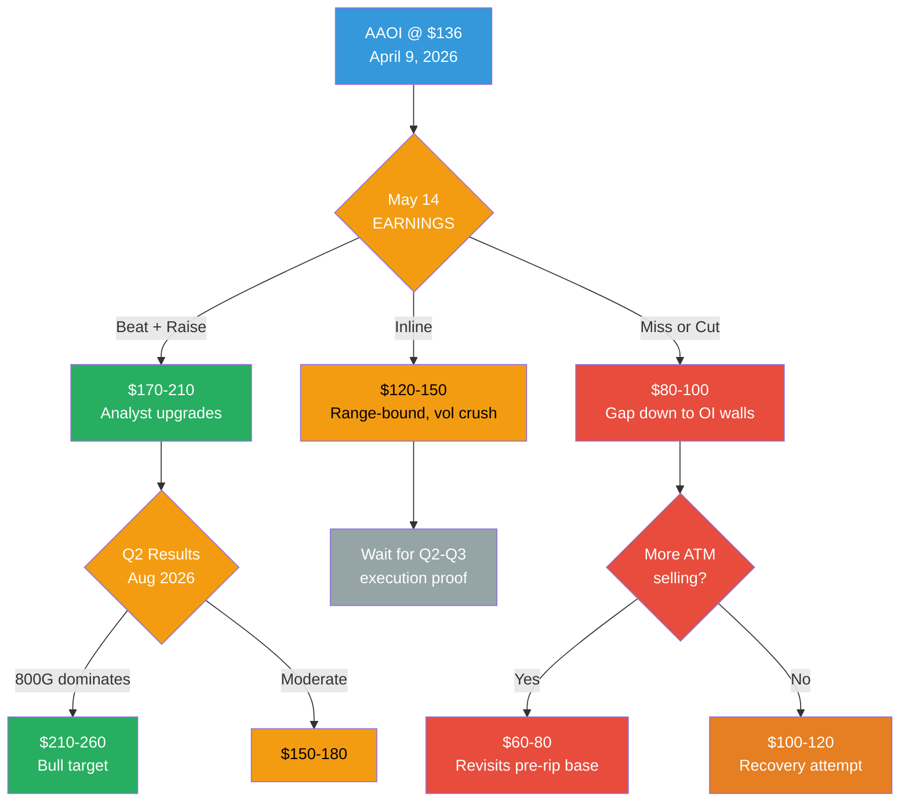

# AAOI — Bull vs Bear Outlook

> Data as of April 9, 2026 close: **$136.05** (prev $133.30). Market cap ~$10.0B. Beta 3.95.

---

> [!important] BOTTOM LINE
> AAOI has **already run to our prior 3-month bull case** in 5 trading days. The stock is now trading at/above most mid-bull analytical targets, with IV Rank at 97.8%, max pain uniformly below spot, and flow that is **neutral-to-fading** despite the rip. The risk/reward into the May 14 print is now **binary and violent in both directions**. New longs here are paying peak premium into peak positioning; the cleanest edge left is tactical — long-dated LEAPS with paid-for put protection, or defined-risk spreads rather than naked directional bets.

---

## Scenario Decision Tree



---

## 3-MONTH OUTLOOK (Apr–Jul 2026, spot $136)

> [!note] Probabilities refreshed — AAOI has already executed our prior bull case pre-earnings. The base case probability rises and the bull upside-from-here narrows.

### BULL CASE: $170–210 (Prob: 35%) — *+25% to +54% from spot*

| Catalyst | Mechanism |
|----------|-----------|
| May 14 earnings beat | Revenue guidance >$1B confirmed, GM >32% |
| 800G ramp acceleration | Amazon/Microsoft order flow confirmation |
| 1.6T orders grow | $200M+ initial order expands to $500M+ |
| Squeeze continuation | Beta 3.95 + IV Rank 97.8% = asymmetric upside on any surprise |
| Analyst catch-up | Street raises PTs to $150-200 zone |
| Sugar Land milestone | Facility on-track for summer 2026 |

### BASE CASE: $120–150 (Prob: 40%) — *−12% to +10% from spot*

| Driver | Mechanism |
|--------|-----------|
| Inline earnings + vol crush | $1B guide maintained; IV drops from 160% → 80-100% post-print |
| Range-bound consolidation | Stock oscillates between Apr $110 OI wall and $170-180 resistance |
| Profit-taking | Institutions trimming the +30%-in-5-days move; no fresh catalyst |
| Max pain magnet | Near-term MPs at $90-115 pull spot down on quiet days |

### BEAR CASE: $80–100 (Prob: 25%) — *−27% to −41% from spot*

| Catalyst | Mechanism |
|----------|-----------|
| Earnings miss | Revenue <$230M, margin compression |
| Guidance cut | $1B target looks unreachable |
| Tariff reversal | Congressional action reinstates duties |
| Dilution fear | Another ATM share sale announced |
| Customer loss | Amazon/Microsoft shifts to competitor |
| Gravity to max pain | Post-ER gap fills to Apr 17 MP $90 / May MP $100 OI walls |

---

## 3-YEAR OUTLOOK (Apr 2026–Apr 2029)

```
    PROBABILITY-WEIGHTED SCENARIOS
    ═══════════════════════════════════════════════════════════

    $400 ─ ─ ─ ─ ─ ─ ─ ─ ─ ─ ─ ─ ─ ─ ─ ─ ─ ─ ─ BULL (35%)
         ╱ Revenue $2B+, margins 15-20%, M&A target
    $300 ─ ─ ─ ─ ─ ─ ─ ─ ─ ─ ─ ─ ─ ─ ─ ─ ─ ╱─ ─ ─ ─ ─
                                              ╱
    $200 ─ ─ ─ ─ ─ ─ ─ ─ ─ ─ ─ ─ ─ ─ ─ ─ BASE (40%)
         Revenue $1-1.5B, profitability achieved  ╲
    $150 ─ ─ ─ ─ ─ ─ ─ ─ ─ ─ ─ ─ ─ ─ ─ ─ ─ ─ ─ ╲─ ─ ─
    $136 ═══ CURRENT (Apr 9, 2026) ════════════════ ╲═══
                                                      ╲
    $25  ─ ─ ─ ─ ─ ─ ─ ─ ─ ─ ─ ─ ─ ─ ─ ─ ─ ─ ─ ─ ─ ╲
    $10  ─ ─ ─ ─ ─ ─ ─ ─ ─ ─ ─ ─ ─ ─ ─ ─ ─ BEAR (25%)
         AI cycle peaks, CPO disrupts, customer loss
         2026                    2028              2029
```

> [!note] **The stock has moved from the $100 midpoint into the base-case zone ($120-200) in the span of a month.** Valuation is no longer as asymmetric; the 3-year upside to $400 is +194% vs 3-year downside to $10 at −93%. Risk/reward remains attractive if you believe in the $2B+ FY2027 thesis, but the margin of safety has compressed materially.

### BULL ($250–400, 35% probability)

**Requirements for this scenario:**
- [ ] FY2026 revenue exceeds $1B
- [ ] FY2027 revenue reaches $1.5-2B
- [ ] Operating margins expand to 15-20% (operating leverage)
- [ ] 1.6T design wins at 2+ hyperscalers
- [ ] Sugar Land facility fully operational and profitable
- [ ] FCF turns positive by FY2027
- [ ] Possible acquisition bid from Broadcom, Cisco, or hyperscaler at $300+

**Why this is possible:**
- AI infrastructure is a multi-year supercycle (not 1 quarter)
- EML technology is critical for 200G/lane (1.6T era)
- Vertical integration provides margin advantage as industry commoditizes
- $2B revenue at 6-8x P/S = $12-16B market cap = $160-213/share
- M&A premium could add 50-100%

### BASE ($120–200, 40% probability)

**What happens:**
- Revenue reaches $1-1.5B by FY2028
- Profitability achieved but margins compressed by InnoLight competition
- Valuation normalizes from 18x to 6-8x P/S on higher revenue base
- Stock grinds higher with episodic 30-50% swings (beta 3.47)
- Insider selling slows as stock consolidates
- Dilution continues at more modest pace

### BEAR ($10–25, 25% probability)

**This is NOT extreme — AAOI traded at $2-10 in 2022:**

| Trigger | Impact |
|---------|--------|
| AI CapEx cycle peaks 2027 | Hyperscalers cut spending = revenue cliff |
| CPO adoption accelerates | Pluggable transceiver TAM shrinks 50%+ |
| US-China complete decoupling | Ningbo stranded, substrate costs spike |
| Customer loss | Amazon/Microsoft to InnoLight/Coherent |
| Dilution spiral | $500M+ more shares issued, EPS diluted |
| Revenue reverts to $300M | Market cap collapses to $1-2B |

---

## CONVICTION SCORECARD (refreshed Apr 9, 2026)

```
    FACTOR              BULL ◄──────────► BEAR     NET (Δ vs Apr 6)
    ═══════════════════════════════════════════════════════════════
    Institutional flow  ██████████░░░░░░░░  BULL (↓ softening)
    Insider activity    ░░░░░░░░████████████  STRONG BEAR (↓ $63.5M sold)
    Options structure   ██████████░░░░░░░░  NEUTRAL-BULL (↓ from bull)
    Revenue trajectory  ██████████████████  STRONG BULL
    Valuation           ░░░░░░░░░░░░██████  BEAR (↓ at $10B cap)
    Technology moat     ██████████████░░░░  BULL
    Supply chain pivot  ████████████░░░░░░  BULL (improving)
    Geopolitics         ██████████████░░░░  BULL (paradoxical)
    Dilution            ░░░░░░░░████████████  BEAR
    CapEx/RORE          ████████████░░░░░░  BULL (↑ $600B+ confirmed)

    OVERALL: CAUTIOUSLY BULLISH — but the price rip has
    materially shifted the risk/reward: bull upside from
    $136 is now +25-54% (vs +44-73% at $104), while bear
    downside has roughly the same magnitude. Edge has
    narrowed. ZERO margin for execution error.

    Δ vs prior: Flow and options structure weakened because
    net call premium is now NEUTRAL despite the rip — pros
    are not confirming the move. Insider activity worsens as
    the full ~$63.5M 2025-2026 selling tally is captured.
```

---

## AI CapEx Macro Backdrop

```
    HYPERSCALER CAPEX (Big 4-5: AMZN, MSFT, GOOG, META, +ORCL)
    ══════════════════════════════════════════════════════════

    2023:  $155B
    2024:  $251B   (+62%)
    2025:  $347-380B (+50%)
    2026E: $610-750B (+60-97%)  ← revised higher post-earnings

    2026 company guidance (from recent earnings calls):
    • Amazon:    ~$200B
    • Alphabet:  $175-185B
    • Meta:      $115-135B
    • Microsoft: ~$120B+
    • Oracle:    ~$50B
    ≈75% of this is AI-specific (~$450B of AI infrastructure)

    Optical transceiver TAM:
    2024: $10-14B
    2025: $14-16B
    2026: ~$17B
    2027: ~$19-21B

    800G market: doubling in 2025, +60% in 2026
    1.6T market: $500M-$1.7B in 2025 → 20M units in 2026

    DURATION: Analysts project 5-7+ year supercycle
    ~$3 TRILLION in compute spending planned 2025-2028
    AI model capacity doubling every 7 months
```

```
    ┌──────────────────────────────────────────────────────────┐
    │ NVIDIA'S OPTICAL INVESTMENTS (verified Mar-Apr 2026)     │
    │                                                          │
    │ $2B → Coherent  (COHR) — announced early March 2026     │
    │ $2B → Lumentum  (LITE) — announced early March 2026     │
    │ $2B → Marvell   (MRVL) — announced April 1, 2026        │
    │ ──────                                                   │
    │ $6B total — all three CONFIRMED from multiple sources.   │
    │                                                          │
    │ AAOI WAS NOT INCLUDED in the $6B photonics round.        │
    │ This is a COMPETITIVE RISK — COHR, LITE and MRVL now     │
    │ have NVIDIA's strategic backing. AAOI does not.          │
    │                                                          │
    │ HOWEVER: AAOI has the AMAZON warrant deal ($4B commit-   │
    │ ment). Different hyperscaler, same strategic alignment.  │
    └──────────────────────────────────────────────────────────┘
```

---

## M&A Acquisition Scenario

```
    OPTICAL M&A PRECEDENTS (EV/Revenue)
    ═════════════════════════════════════

    II-VI / Finisar (2018):         2.2x  (downcycle) <!-- verified -->
    Lumentum / NeoPhotonics (2021): 3.5x  <!-- needs verification -->
    Lumentum / Cloud Light (2023):  3.6x  <!-- needs verification -->
    Cisco / Acacia (2021):          7.7x  (high-IP premium) <!-- needs verification -->
    Marvell / Celestial AI (2025):  N/A   (pre-revenue)

    AAOI ACQUISITION MATH (spot $136, cap ~$10.0B):
    ┌──────────────────────────────────────────────────┐
    │ At 3.5x FY2026 rev ($1B):    $3.5B  UNDER water  │
    │ At 5.0x FY2026 rev ($1B):    $5.0B  UNDER water  │
    │ At 7.7x FY2026 rev ($1B):    $7.7B  UNDER water  │
    │ At 5.0x FY2027 rev ($2B):    $10.0B ~ flat       │
    │ At 7.7x FY2027 rev ($2B):    $15.4B +54% premium │
    │ At 5.0x FY2028 rev ($2.5B):  $12.5B +25% premium │
    │ Current market cap:          ~$10.0B              │
    │                                                  │
    │ PROBLEM: Stock already prices in $2B FY2027      │
    │ revenue at ~flat M&A multiple. Any acquirer      │
    │ now has to underwrite $2B+ FY2027 AND pay a      │
    │ 25-50% control premium → $13-16B take-out.       │
    │                                                  │
    │ At this valuation the "acquisition" thesis is    │
    │ WEAKER than it was at $7.8B. A strategic would   │
    │ be smarter to wait for any earnings-driven       │
    │ pullback to re-enter the discussion.             │
    │                                                  │
    │ Most logical acquirer: MICROSOFT or AMAZON       │
    │ (existing customer, strategic supply chain need) │
    │                                                  │
    │ Thompson Lin (founder, 29 yrs) holds 4.4%        │
    │ Cannot unilaterally block — needs board + vote   │
    └──────────────────────────────────────────────────┘
```

---

## Critical Dates

| Date | Event | Expected Impact |
|------|-------|----------------|
| **May 14, 2026** | **Q1 2026 Earnings** | **THE catalyst — make or break** |
| Summer 2026 | Sugar Land facility operational | Positive if on-track |
| Aug 2026 | Q2 earnings | 800G "dominates revenue" — validation |
| Nov 2026 | Q3 earnings | $1B run-rate validation |
| 2027 | DoD Chinese parts ban takes effect | Potential defense upside |
| 2027-2028 | CPO deployment decisions | Existential risk monitor |
| 2035 | Amazon warrant expiry | $4B purchase commitment deadline |

---

## Position Sizing Guidance

```
    ┌──────────────────────────────────────────────────────────┐
    │ THIS IS A HIGH-VOLATILITY, HIGH-CONVICTION POSITION      │
    │                                                          │
    │ Beta 3.95 means (up from 3.47 — volatility regime shift):│
    │ - A 10% S&P drop = ~40% AAOI drop                        │
    │ - A bad earnings = 40-50% overnight gap down             │
    │ - A good earnings = 30-50% overnight gap up              │
    │                                                          │
    │ IV Rank 97.8% means:                                     │
    │ - Options are the most expensive they have been in a    │
    │   year. Buying premium is costly; selling is dangerous   │
    │   (see Q4 2025: implied ~14%, actual +57% in one day).   │
    │                                                          │
    │ SUGGESTED SIZING (at $136 spot):                         │
    │ - Conviction long: 2-4% of portfolio max (trimmed from   │
    │   3-5% given the price has already run to the bull case) │
    │ - Options play: defined risk ONLY (spreads, not naked)   │
    │   - Call debit spreads OR call calendars (vol-crush edge)│
    │   - Long-dated LEAPS + put protection structure          │
    │ - Stop loss: $100 (next OI wall / Apr 10 MP / pre-rip    │
    │   base). $81 is too far to be a meaningful stop at $136. │
    │ - Take profit: scale out at $170, $190, $210+            │
    │                                                          │
    │ KEY RISK: The stock has gone from $100+ to $2 before.    │
    │ At $136 with IV maxed, asymmetry is less favorable than  │
    │ it was at $81. Size accordingly.                         │
    └──────────────────────────────────────────────────────────┘
```

#AAOI #outlook #bull #bear #trading
